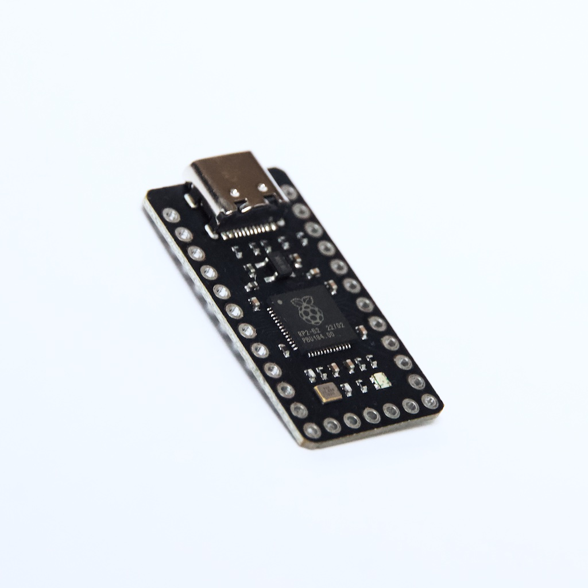
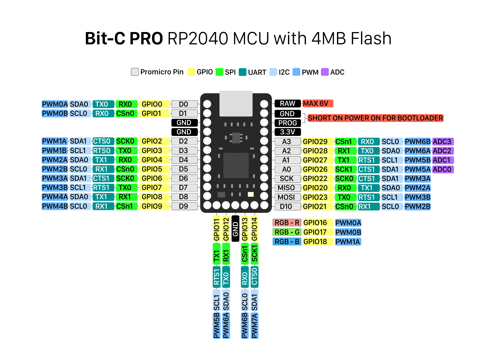
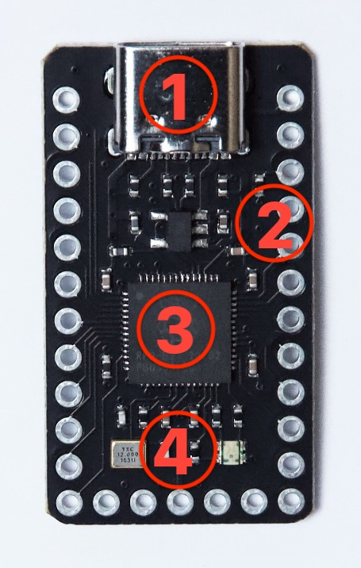
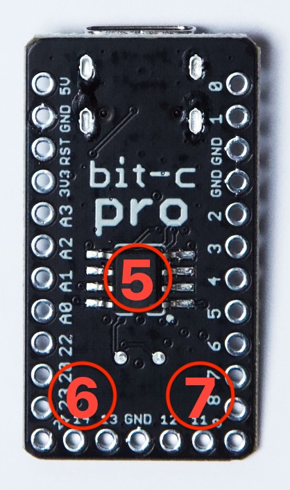

# BIT-C PRO

## Pro Micro Compatible RP2040 MCU with 4MB Flash & USB-C

## User Guide

# Contents

- [Helpful Links](#helpful_links)  
- [Board Overview](#board_overview)  
- [Guides and Examples](#guides)  
   - [Flashing firmware](#flashing_firmware)  
   - [Using the Bit-C PRO with QMK](#qmk)  
   - [Using the Bit-C PRO with pico-sdk](#pico_sdk)  
   - [Using the Bit-C PRO with Arduino IDE](#arduino_ide)  
   - [Using the Bit-C PRO with Micropython](#micropython)  
   - [Using the Bit-C PRO with Circuitpython](#circuitpython)  

#  Helpful links

- [RP2040 spec & datasheet](https://www.raspberrypi.com/products/rp2040/specifications/)
- [QMK converter documentation](https://github.com/qmk/qmk_firmware/blob/master/docs/feature_converters.md)
- [Raspberry Pi pico-sdk](https://github.com/raspberrypi/pico-sdk)
- [Arduino-pico](https://github.com/earlephilhower/arduino-pico)
- [Micropython](https://micropython.org/download/NULLBITS_BIT_C_PRO/)
- [Circuitpython](https://circuitpython.org/board/nullbits_bit_c_pro/)

#  Board Overview

| Board Specifications |  |
| --- | --- |
| Dimensions | 18.5mm (w) x 33.4mm (h) |
| User accessible GPIO pins | 22  |
| GPIO voltage level | 3.3V  |
| Maximum input voltage on RAW pin | 6V  |
| Processor | Dual-core Arm Cortex-M0+  |
| Clock speed | Standard up to 133 MHz , overclocked 400+ MHz    |
| RAM | 264kB SRAM on-chip    |
| Flash storage | 4MB on-board    |
| Interfaces | UART (2), SPI (2), I2C (2), PWM (16), + PIO (8)    |
| USB | USB 1.1 controller + PHY, host & device support  |
| Operating temperature | -40°C to +85°C, onboard temperature sensor |

## Pinout

## Components

|  |  |
| --- | --- |

1. USB-C connector
1. 3.3V voltage regulator (left)
1. RP2040 MCU
1. RGB LED (right)
1. Flash storage
1. SWD pad: IO
1. SWD pad: CLK

#  Guides and Examples

##  Flashing Firmware

### Loading new firmware

In order to load a new firmware file, the Bit-C PRO must be put into bootloader mode. The Bit-C PRO comes in bootloader mode from the factory, and will automatically be in bootloader mode the first time it's plugged in. Subsequent firmware updates will require manually entering bootloader mode. There is no reset or bootloader button on the Bit-C PRO. To enter firmware update mode, short the PROG pin to GND before plugging in the USB cable.

The LED will glow dim white when the board is in bootloader mode, and the Bit-C will register as an external USB mass storage device named `RPI-RP2`.

Loading a firmware file is as simple as copying a `.uf2` file to the USB device. The Bit-C PRO will immediately disconnect from the PC, reboot, and run the new code.

### Erasing firmware

To completely erase the on-board flash, load the [erase flash firmware](https://nullbits.co/static/file/erase_flash.uf2) to the Bit-C PRO. The onboard LED will flash 3 times once the flash has been erased. The Bit-C PRO will automatically enter bootloader mode when the flash is erased.

## Using the Bit-C PRO with QMK

There are two ways to use the Bit-C PRO with QMK firmware.

Boards which have been designed for the Bit-C PRO will compile without changes. All nullbits boards fit into this category and can be compiled by adding `rp2040` to the board name. For example, to compile for a NIBBLE built with a Bit-C PRO: `qmk compile -kb nullbitsco/nibble/rp2040 -km default`.

Boards that have not been designed for RP2040-based MCUs can be automagically converted using the [QMK converter feature](https://github.com/qmk/qmk_firmware/blob/master/docs/feature_converters.md). Simply pass `-e CONVERT_TO=bit_c_pro` when compiling. For example, to compile for a Corne built with Bit-C PROs: `qmk compile -kb crkbd -km default -e CONVERT_TO=bit_c_pro`. The resulting binary will be named `crkbd_rev1_via_bit_c_pro.uf2` and can be flashed by following the [flashing firmware](#flashing_firmware) section.

## Using the Bit-C PRO with pico-sdk

The Bit-C PRO is fully supported within the official Raspberry Pi Pico SDK. Any and all pico-sdk examples will compile for the Bit-C without any modification as long as `-D"PICO_BOARD=nullbits_bit_c_pro"` is passed to `cmake`.

For example, follow the normal [blink tutorial](https://www.raspberrypi.com/news/how-to-blink-an-led-with-raspberry-pi-pico-in-c/),  starting at the "Getting the SDK" section, and compiling with `cmake -D"PICO_BOARD=nullbits_bit_c_pro" ..; make` instead of the commands given in the tutorial.

The onboard LED pin definitions are included in the Pico SDK. Use `BIT_C_PRO_LED_R_PIN`, `BIT_C_PRO_LED_G_PIN`, and `BIT_C_PRO_LED_B_PIN` to access the RGB LED channels.

## Using the Bit-C PRO with Arduino IDE

The Bit-C PRO can be programmed from within Arduino IDE natively, without any bootloader or code changes.

To install the required Core for Arduino, follow this [Excellent Adafruit tutorial](https://learn.adafruit.com/rp2040-arduino-with-the-earlephilhower-core?view=all).

From the "Boards" menu, choose "Raspberry Pi RP2040 Boards --> nullbits Bit-C PRO", and select and upload any of the examples.

## Using the Bit-C PRO with Micropython

The Bit-C PRO is fully supported by Micropython.

To start, load the [Micropython firmware for the Bit-C PRO](https://micropython.org/download/NULLBITS_BIT_C_PRO/).

Follow the example in the [README](https://github.com/micropython/micropython/tree/master/ports/rp2/boards/NULLBITS_BIT_C_PRO) to blink the onboard LED.

For an even better Micropython experience, use the [Thonny IDE](https://learn.sparkfun.com/tutorials/pro-micro-rp2040-hookup-guide/examples-micropython). It rocks!

## Using the Bit-C PRO with Circuitpython

The Bit-C PRO is fully supported by Circuitpython.

To start, load the [Circuitoython firmware for the Bit-C PRO](https://circuitpython.org/board/nullbits_bit_c_pro/).

Follow the example in this [gist](https://gist.github.com/jaygreco/ef6414000a9033b404bdd093d52cdce5) to blink the onboard LED.

For an even better Circuit experience, use the [Mu IDE](https://learn.adafruit.com/welcome-to-circuitpython/installing-mu-editor)!
