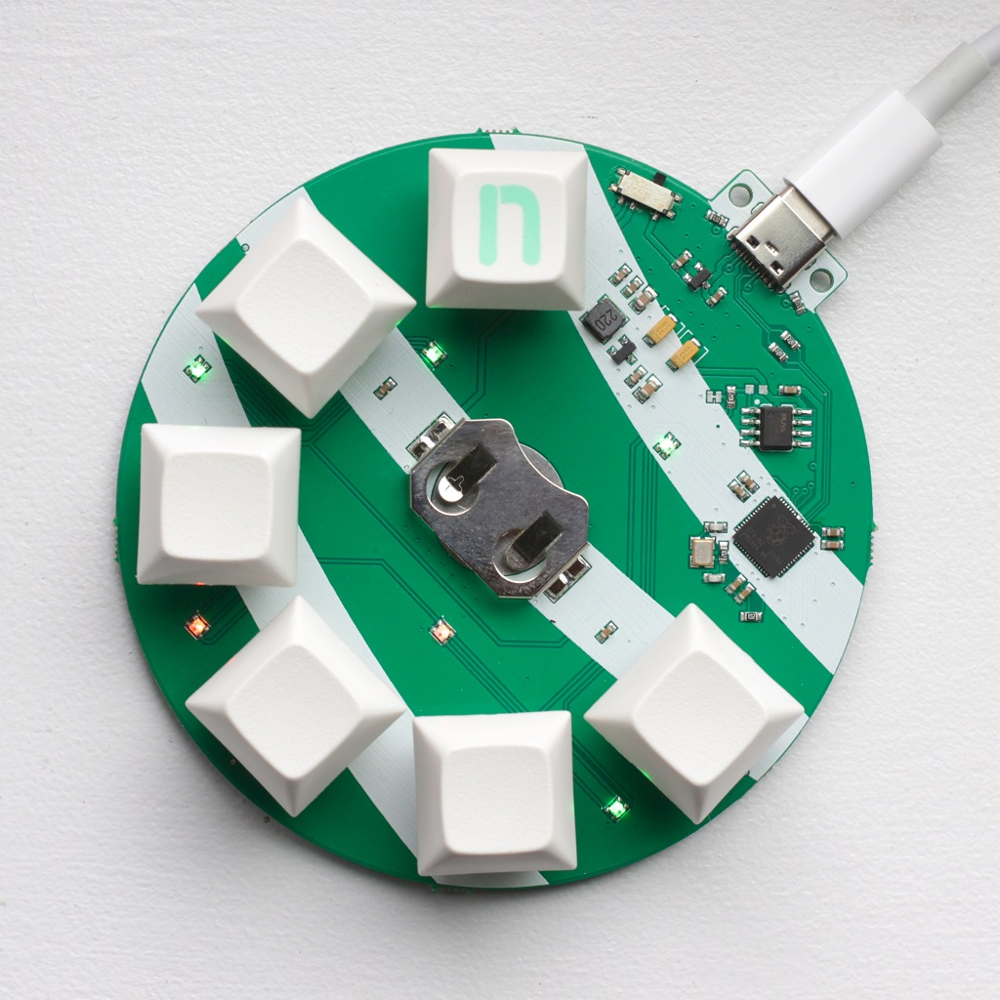
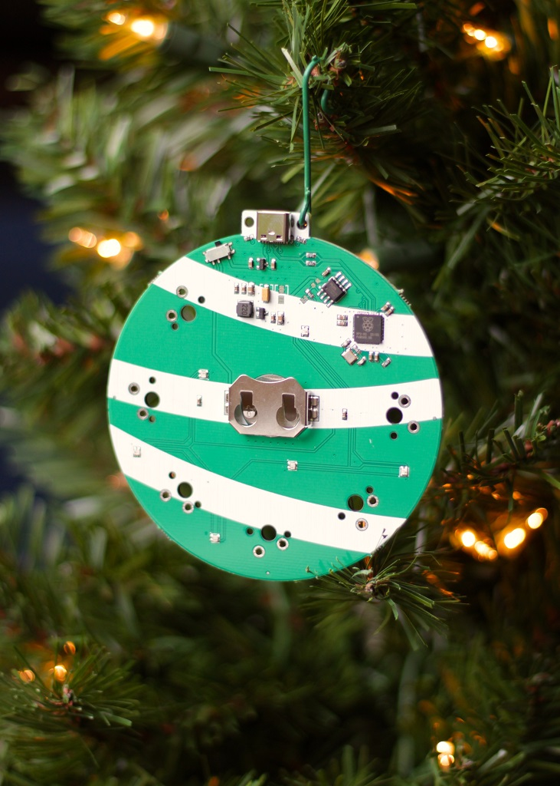
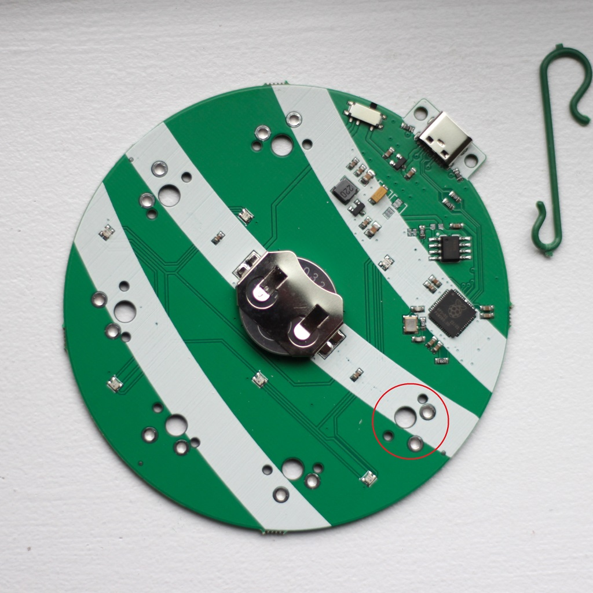

# HOLLY

## 6-key RP2040 macropad and ornament

## User Guide

# Contents

[Helpful Links](#helpful_links)  
[Quickstart Guide](#quickstart_guide)  
[Firmware Flashing](#firmware_flashing)

#  Helpful links

- VIA software link: https://caniusevia.com
- VIA demo video: https://www.youtube.com/watch?v=WZKf2TvUZ7Q
- VIA guide: https://www.youtube.com/watch?v=78zVepszCmE
- HOLLY QMK firmware: https://github.com/nullbitsco/firmware/releases
- HOLLY source code: https://github.com/nullbitsco/holly/tree/main

#  Quickstart Guide

## Plug in HOLLY

Plug HOLLY into your computer using a USB-C cable. Flip the switch to the "USB" position, which is toward the USB connector.

## Ornament mode

Insert a CR2032 battery, pop on the attached ornament hook, and slide the power switch to the left (battery-powered ornament mode). HOLLY will shut off after 3 hours to conserve battery. Flip the switch back and forth between USB and battery mode and it'll turn back on!

_Top secret tip: hold one of the switches (except for S1, circled above in the Flashing Firmware section) to twinkle with a different color and/or pattern!_

## Customizing your HOLLY

You'll probably want to assign a keycode to each switch that isn't F1 - F6. Open [VIA](https://usevia.app/#/), and it'll show up as a SCRAMBLE. Why? Because it is already supported, and adding a brand new board to QMK and VIA before the holidays was...unlikely to happen.

Ho, Ho, Ho! Bind the keys however you want to! The world is your winter oyster!

If you want to customize the RGB, download the `json` config from [here](https://raw.githubusercontent.com/nullbitsco/holly/main/keymaps/via/holly_via.json) and load it into VIA using the "Load Draft Definition" button.

## Flashing firmware

HOLLY is flashed using the same method as the [SCRAMBLE](../scramble/user_guide_en.md#firmware_flashing), as it's based on the same RP2040 MCU. To enter bootloader mode, slide the power switch to the right (USB mode), and short S1 (circled in red) while powering on the device. A new USB device called RPI-RP2 will appear. Drag and drop a .UF2 firmware file to flash.

# What the heck is "HOLLY LPM"??

It sounds like you've dug through the firmware (bravo)! That's the name in the firmware for ornament mode. The normal QMK firmware uses way too much power, and the battery wouldn't last more than a few hours on it. That simply would not do! As QMK doesn't support any of the required low power functions, we wrote a completely separate Low Power Mode (LPM) firmware that's embedded into the main QMK firmware.

When HOLLY starts up, it checks to see if there is no active USB connection, and whether or not the supplied voltage is low enough to be supplied by the battery. If either of these conditions are true, it uses some funky ARM assembly code to jump to the address that the LPM firmware is stored at. The LPM firmware reconfigures the RP2040 to run on the internal clock and turns off the USB and basically every other peripheral since they all use power when they're not doing anything. From this point onward, the LPM firmware sleeps in ultra-low power mode and wakes up every so often to twinkle the LEDs and look pretty. After 3 hours, HOLLY shuts off completely in order to save battery.
