# NIBBLE Acrylic Case

## Stacked Acrylic Case for NIBBLE 65% Keyboard

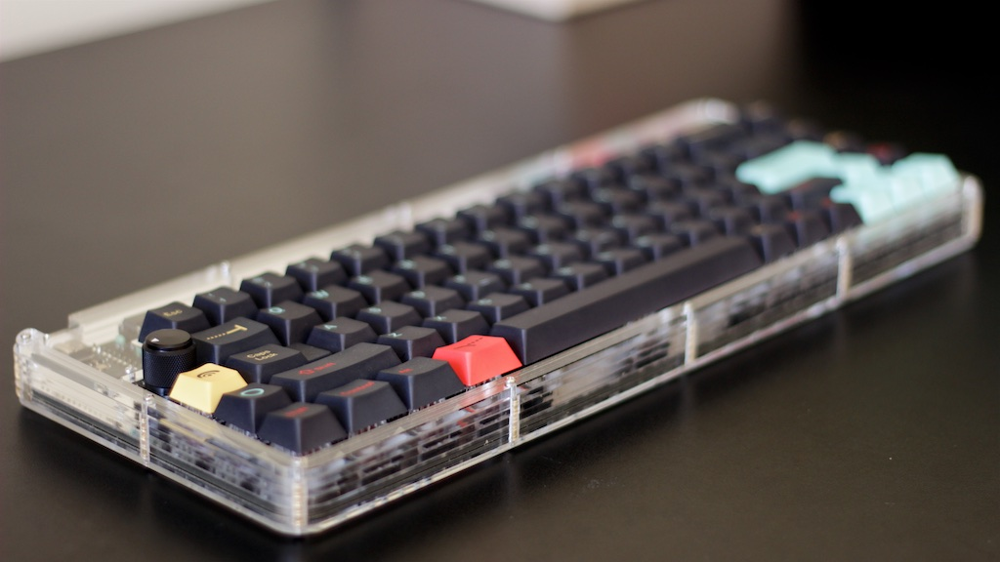

## Build Guide

# Contents

[Parts and Tools](#parts_and_tools)

[Assembly Steps](#assembly_steps)

#  2. Parts and tools

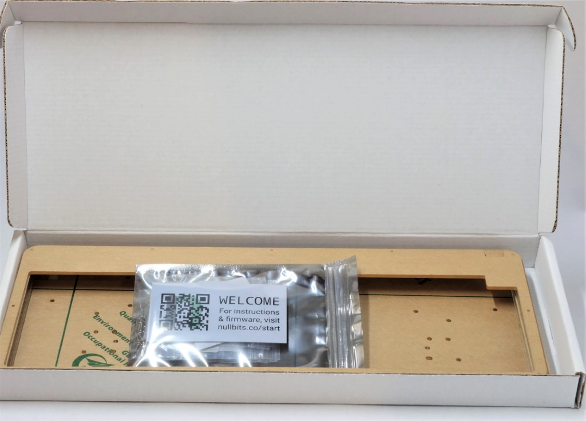

## 1. Parts included in the kit

### Hardware

| **Item**        | **Qty.** | **Image**                              |
| --------------- | -------- | -------------------------------------- |
| Standoff, M2x12 | 16       | 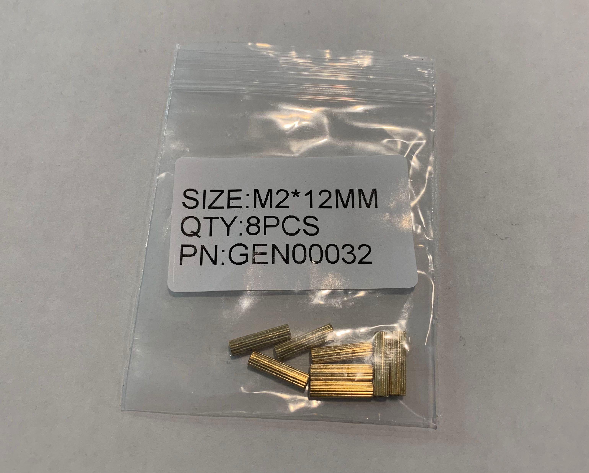 |
| Screw, M2x6     | 30       | 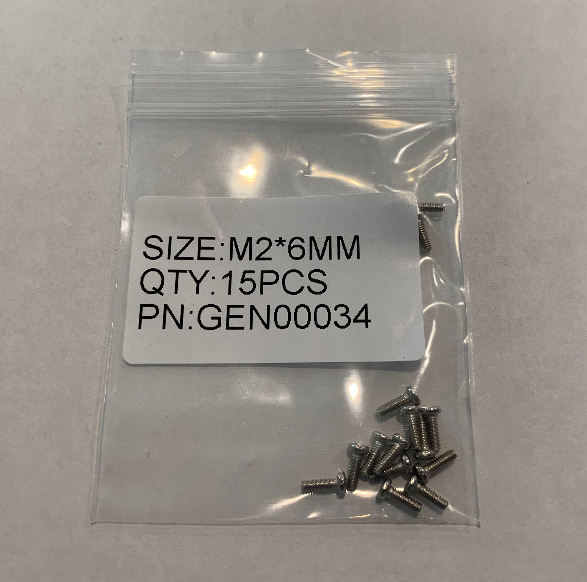 |
| Screw, M2x10    | 16       | 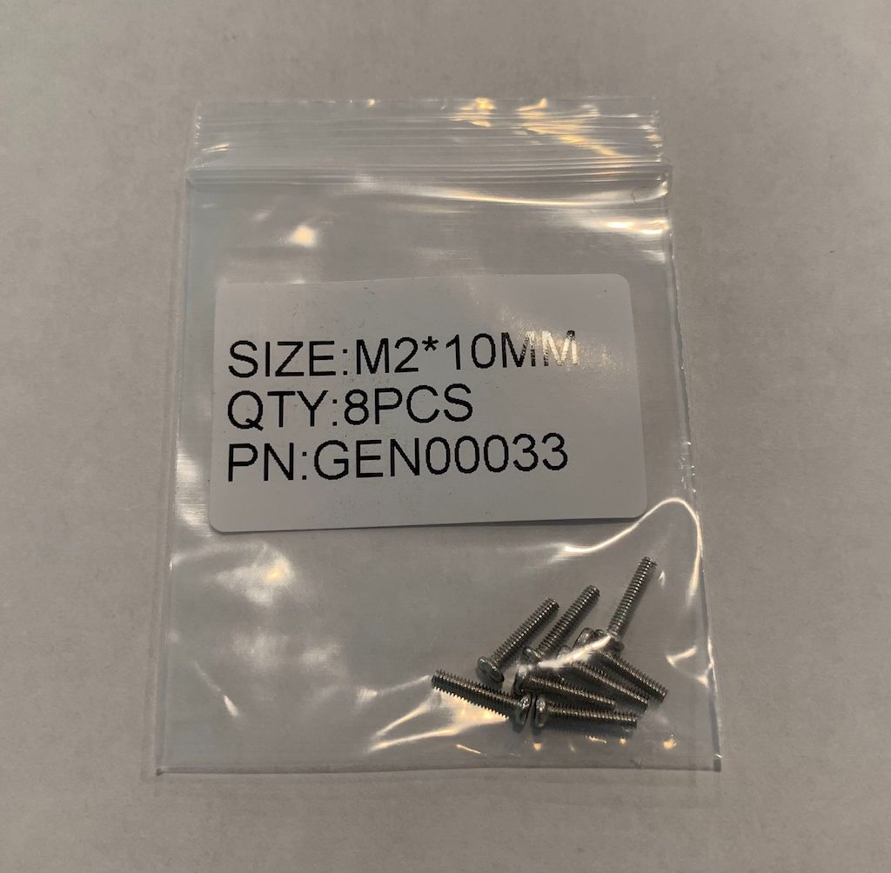 |
| Rubber Bumpons  | 4        | 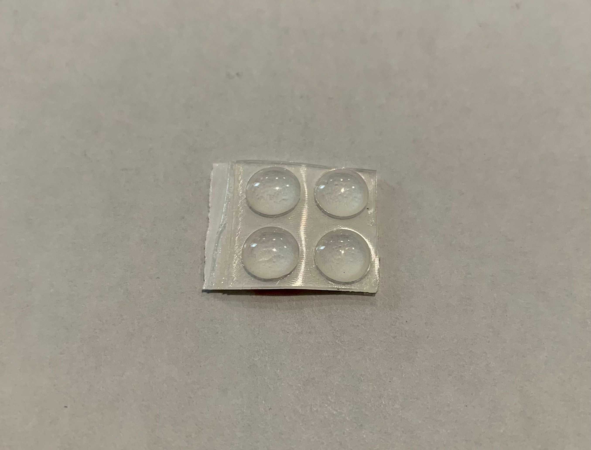 |

### Acrylic

| **Item**                   | **Qty.** | **Image**                              |
| ---------------------------| -------- | -------------------------------------- |
| Case top layer             | 1        | 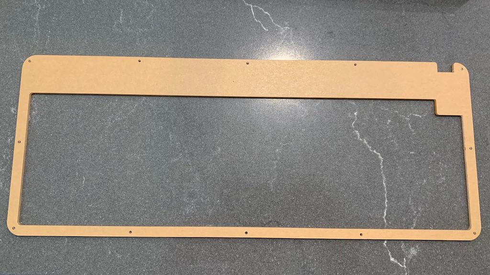 |
| Case lower-mid layer (3mm) | 1        | 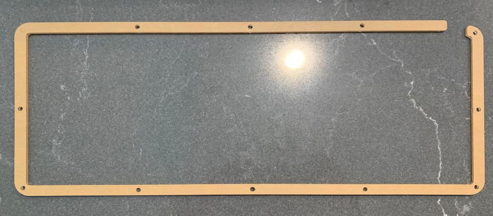 |
| Case upper-mid layer (4mm) | 3*       | 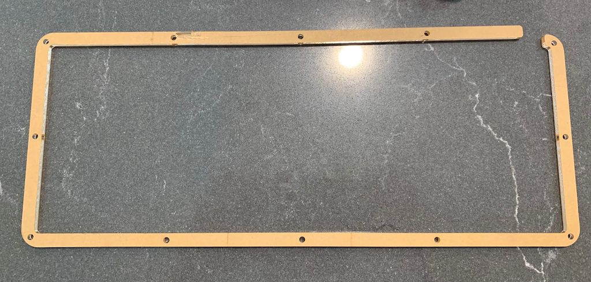 |
| Case bottom layer          | 1        | 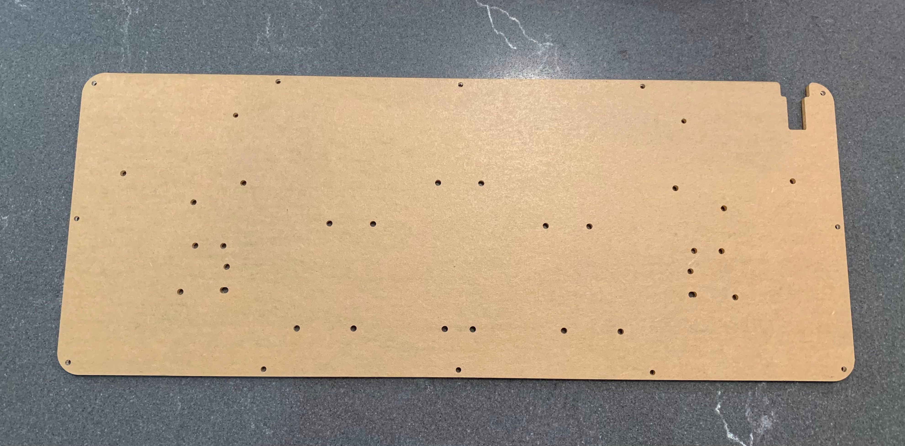 |

*Early versions of the case came with two 3mm and two 4mm mid-layers. An extra 4mm mid-layer has since been added in order to increase the case thickness for maximum compatibility. 
## 2. Tools required

- Phillips #0 screwdriver
- **[Recommended]** Rubbing alcohol/microfiber cloth for cleaning acrylic 
- **[Recommended]** Small file, for cleaning up acrylic interferences, rough edges, etc

#  3. Assembly Steps

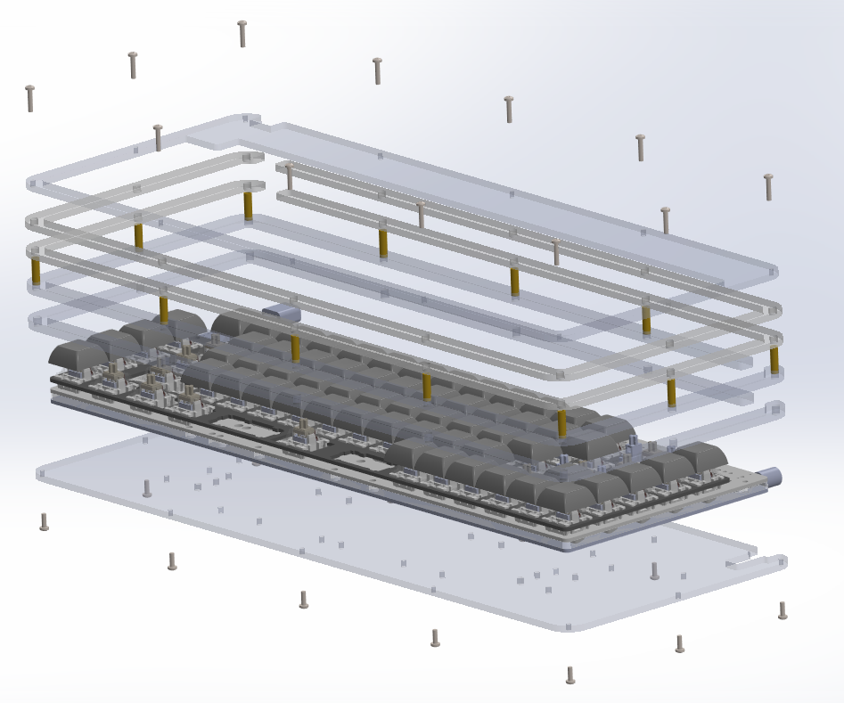

⚠️ **Important!** Notes marked with this icon are crucial, so be sure to read them carefully before moving on.

⚠️ **Stop!** If at any point during your build you find yourself confused, stuck, not sure whether something you're doing is right, or not sure what to do next, stop and ask! On average, questions are answered on Discord or via email in less than a few hours. Better to ask questions that might feel silly than to make a mistake!

Steps marked [OPTIONAL] aren&#39;t required for the base kit, but may be needed depending on what you choose to include in your build.

## 1. Remove backplate screws and feet/bumpons

If your NIBBLE is already assembled, remove the 13 M2x3mm screws holding the backplate on the board, along with the 2 M2x10mm screws and standoffs holding on the top acrylic guard. These screws will be replaced with M2x6mm screws included with the case kit. Remove any feet or bumpons from the backplate.

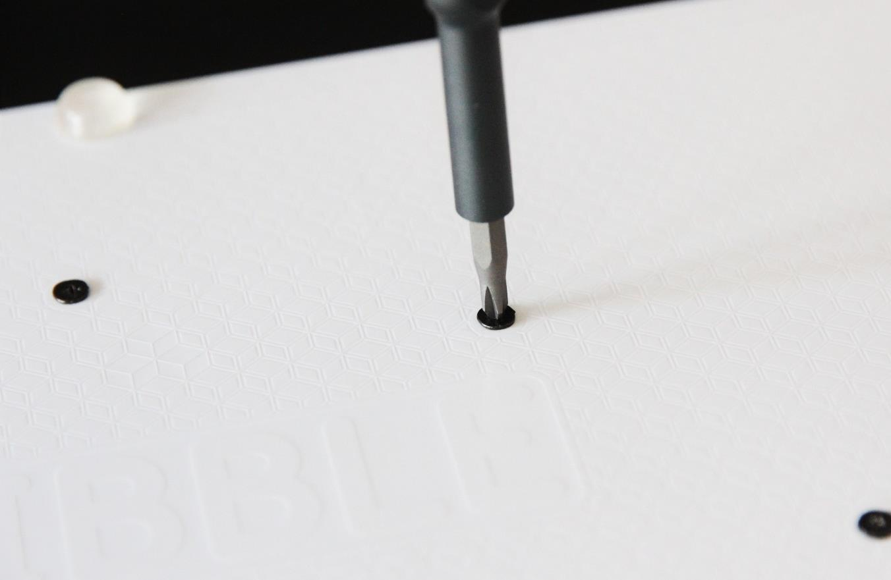

If your NIBBLE is not yet fully assembled, do not fasten the backplate on with the M2x3mm screws.

## 2. Choose TRRS orientation

The bottom acrylic layer has a cutout for the TRRS jack. Select the correct orientation, with the TRRS cutout on the left or right of the board. It should match the TRRS location on your NIBBLE. Peel and remove the acrylic backing material from the acrylic layer, and wipe it clean with a microfiber cloth or rubbing alcohol.

| **Image**                         |
| --------------------------------- |
|  |
| TRRS on right side                |
| 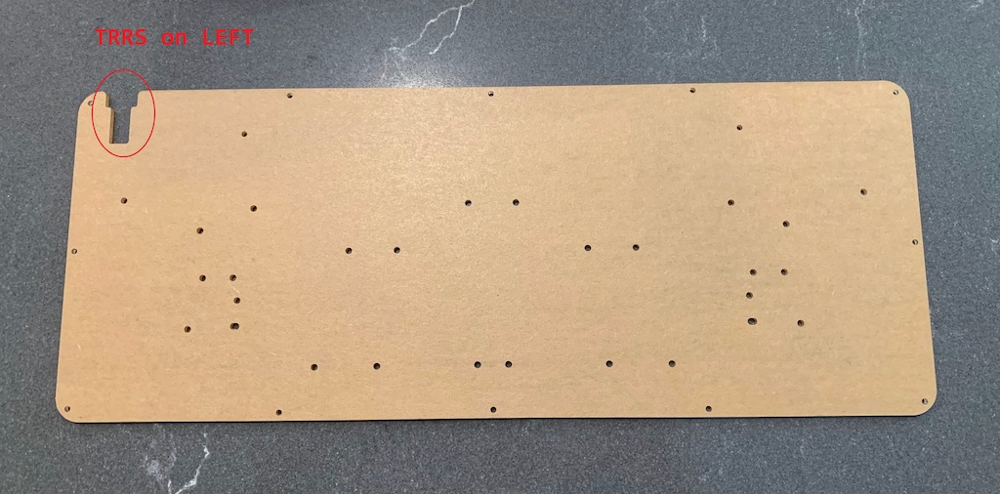 |
| TRRS on left side                 |

⚠️ **Important!** The acrylic case only supports one TRRS jack. If you have two TRRS jacks soldered on your NIBBLE, one TRRS jack must be desoldered in order to fit in the case.

## 3. Screw in M2x12mm standoffs into bottom layer

Using 12x M2x6mm screws, attach the 12 M2x12mm standoffs to the bottom acrylic layer. Be careful to keep the TRRS cutout on the correct side of the board while screwing in the standoffs. Tighten just past hand-tight.

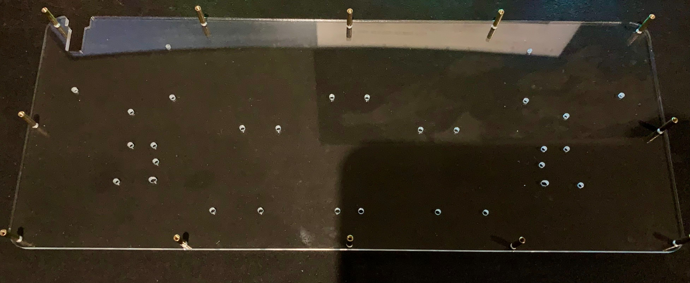

## 4. Screw NIBBLE board into bottom layer

Wipe the bottom layer and the backplate of the NIBBLE clean with a microfiber cloth or rubbing alcohol. Using 13x M2x6mm screws, attach the bottom acrylic layer to the assembled NIBBLE board. Make sure that the M2x12mm standoffs are pointing toward the top of the NIBBLE (in the same direction as the switches and keycaps face). The TRRS jack should sit inside the TRRS cutout.

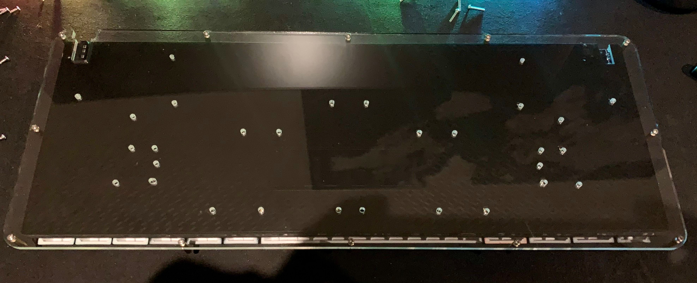

⚠️ **Important!** The NIBBLE attaches to the bottom layer of the case with the inner acrylic spacer and backplate still on. The total thickness will be incorrect if the backplate is left off, and the screws won't tighten. Bumpons must also be removed for this reason.

## 5. Stack lower-middle acrylic layer

Peel and remove the acrylic backing material from the 3mm thick lower-middle acrylic layer, and wipe it clean with a microfiber cloth or rubbing alcohol. Stack the layer on the standoffs, making sure to align the break in the acrylic with the TRRS jack.

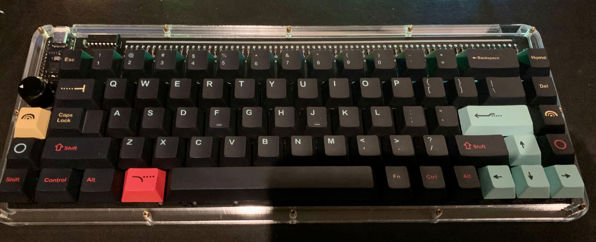

## 5. Stack upper-middle acrylic layers

Peel and remove the acrylic backing material from the three 4mm thick upper-middle acrylic layers, and wipe them clean with a microfiber cloth or rubbing alcohol. Stack the three layers on the standoffs, making sure to align the break in the acrylic with the USB jack on the MCU.

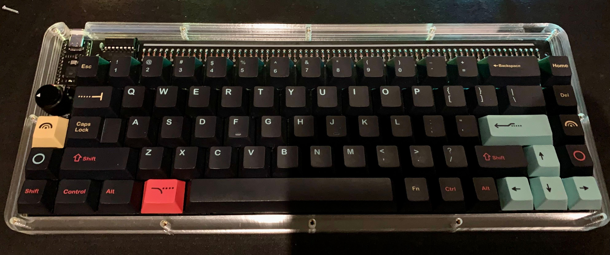

## 5. Stack and fasten top acrylic layer

Peel and remove the acrylic backing material from the top acrylic layer, and wipe it clean with a microfiber cloth or rubbing alcohol. Stack the top layer on the standoff on top of the middle layers, making sure to align the cutout in the acrylic with the USB jack on the MCU. Screw it into the standoffs using 12 M2x10mm screws.

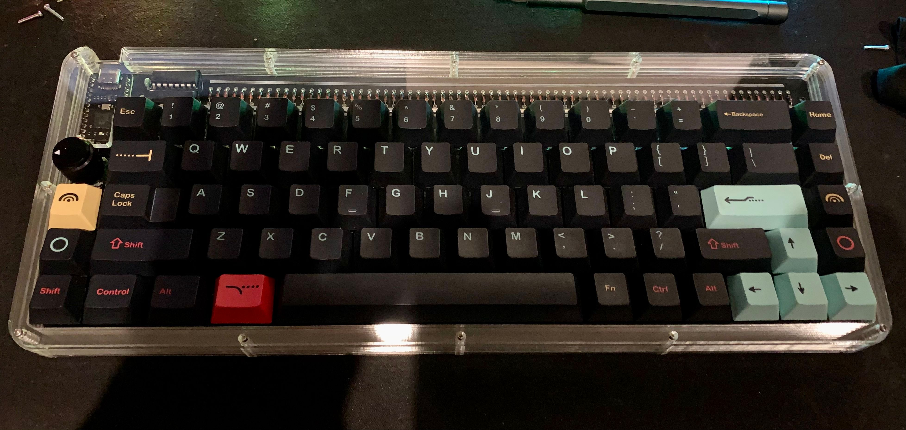

## 5. Attach bumpons and wipe clean

Stick the 4 included bumpons on the bottom sie of the bottom layer, one on each corner. Wipe the top, bottom, and edges of the case clean with a microfiber cloth or rubbing alcohol.

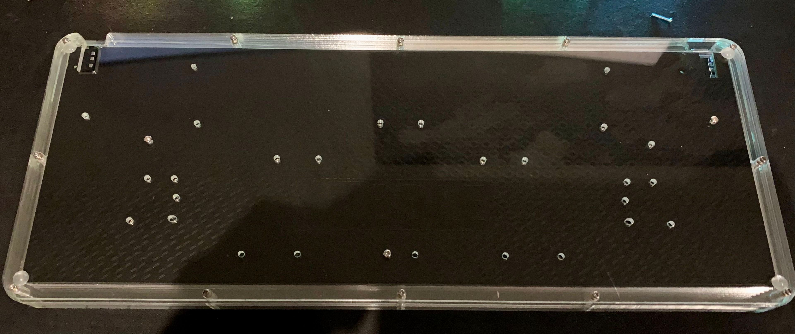

## 5. Enjoy!

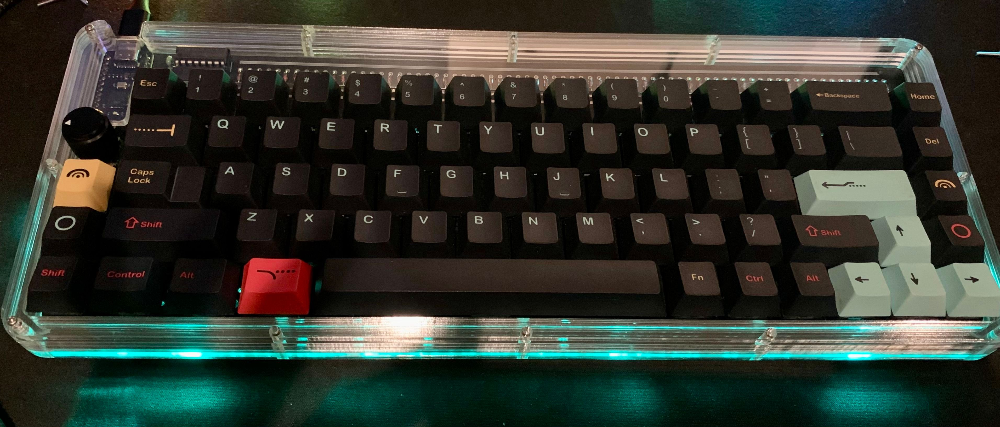

