# SNAP

## 75% Split Keyboard Kit

## Guía de montaje

# Índice

[Enlaces útiles](#helpful_links)

[Componentes y herramientas](#parts_and_tools)

[Instrucciones de montaje](#assembly_steps)

[Solución de errores](#troubleshooting)

## ¡Gracias por la compra!
Nos sentimos honrados por el interés y pasión que NIBBLE y TIDBIT han recibido. Después de mucho investigar, iterar y mejorar, tenemos lo que esperamos sea una evolución aún más popular de ambos. El SNAP (esperamos) recoge lo mejor de ambos y añade un extra. Esperamos que disfrutes montando y usando este teclado tanto como nosotros.

#  1. Enlaces útiles

- [Perfil por defecto](http://www.keyboard-layout-editor.com/#/gists/bd48e2fe5b0f571c0034f27cb328d2d7)
- [Firmware QMK](https://github.com/nullbitsco/snap)
- [Habilidades básicas: Soldadura](https://www.youtube.com/watch?v=UpVx4wGukRc) - Make sure you're prepared to solder your keyboard kit!
- [¡Revisa](build_guide_img/image048.png) la calidad de tus [soldaduras!](build_guide_img/image049.png)
- [Como usar un multímetro](https://www.youtube.com/watch?v=SECWePatYjY) - ¡Importante para diagnosticar problemas!
- [Guía para flashear firmware](https://github.com/nullbitsco/docs/blob/main/firmware/firmware_flashing.md)

#  2. Componentes y herramientas

## 1. Piezas incluidas en el kit

### Hardware

| **Item** | **Qty.** | **Image** |
| --- | --- | --- |
| Standoff, M2x3 | 16 |  |
| Standoff, M2x10 | 6 |  |
| Tornillo, M2x3 | 30 |  |
| Tornillo, M2x6 | 6 |  |
| Tornillo, M2x10 | 6 |  |
| Machined Knob | 1 | 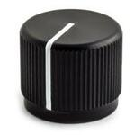 |

### Electrónica

| **Item** | **Qty.** | **Image** |
| --- | --- | --- |
| 1N4148 Diodo | 100 |  |
| 0.1μF Condensador | 2 |  |
| 10KΩ Resistencia | 2 | 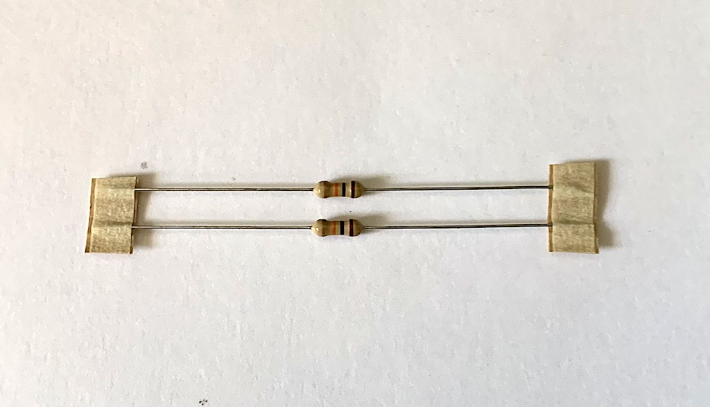 |
| IC Socket | 2 |  |
| IC (74HC138N) | 2 |  |
| Interruptor Reset | 2 |  |
| WS2812B LED | 10 | 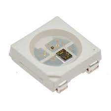 | 
| TRRS Jack | 4 |  |
| Rotary Encoder | 1 |  |
| PTH Buzzer | 1 | 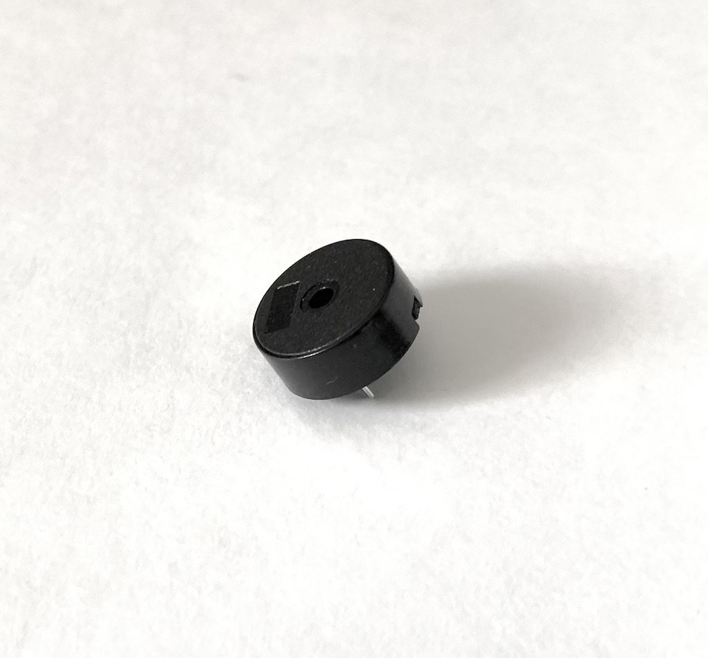 |
| PTH Pogo Pins (male) | 2 | 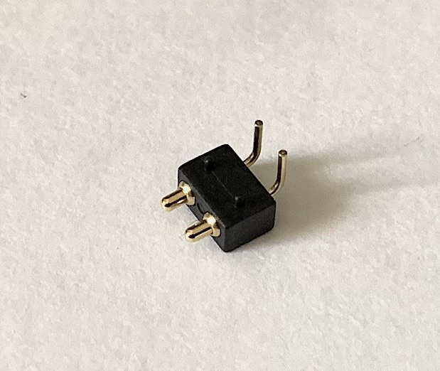 |
| PTH Pogo Pins (female) | 2 |  |
| 40-pin Breakaway Headers | 2 |  |

### Estructura

| **Item** | **Qty.** | **Image** |
| --- | --- | --- |
| Placa superior (izquierda) | 1 | 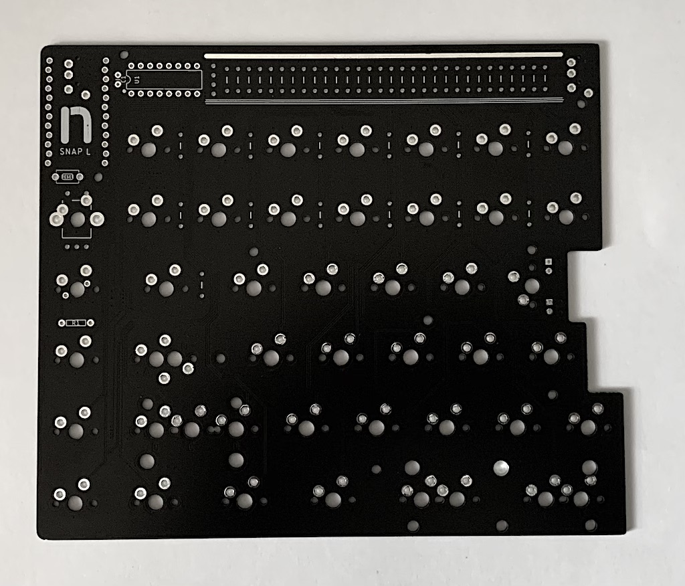 |
| Placa superior (derecha) | 1 | 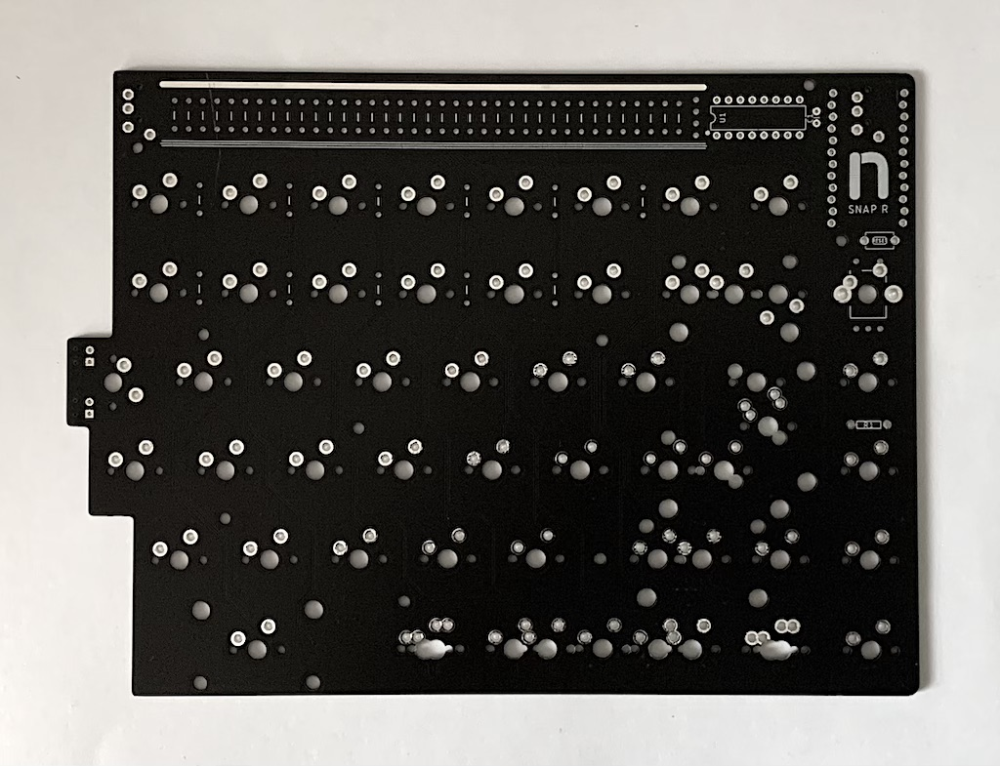 |
| Placa inferior (izquierda) | 1 | 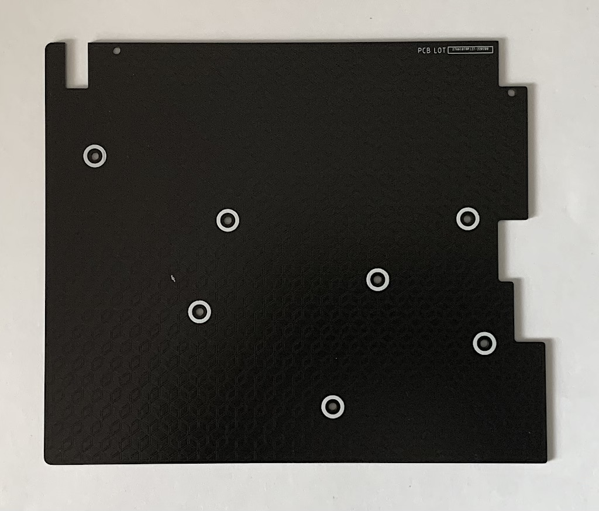 |
| Placa inferior (derecha) | 1 |  |
| Separador central de acrílico (izquierda) | 1 | 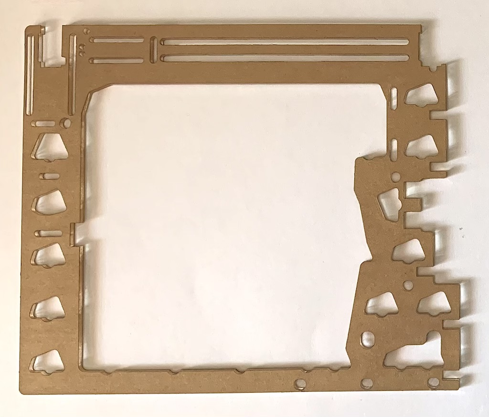 |
| Separador central de acrílico (derecha) | 1 | 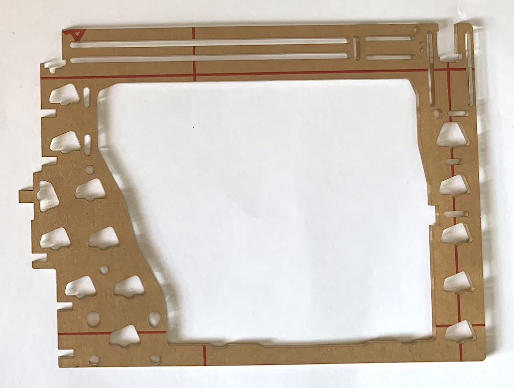 |
| Tapa superior de acrílico (izquierda) | 1 |  |
| Tapa superior de acrílico (derecha) | 1 |  |

### Extras

| **Item** | **Qty.** | **Image** |
| --- | --- | --- |
| Cable TRRS | 1 | 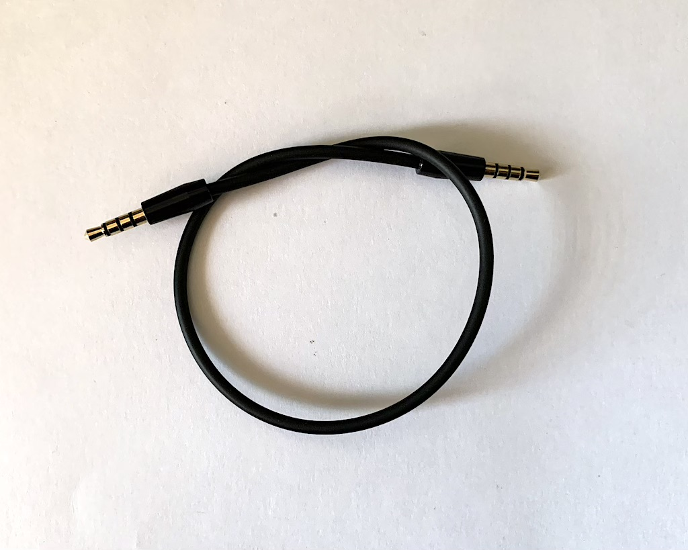 |
| Imanes 3x6mm | 6 |  |
| Pegatinas para imanes | 6 |  |
| Mini patitas | 8 | 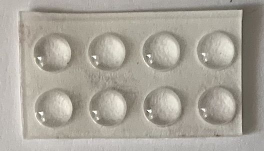 |

## 2. Piezas no incluidas

- 2x [BIT-C](https://nullbits.co/bit-c/) u otro MCU compatible
- 92x switches PCB-mount (tipo Cherry MX)
- 5x 2U estabilizadores PCB-mount*. Sirven tanto los atornillados como de clip.
  - 2x 2U stabs - uno por cada barra espacsiadora.
  - 3x 2U stabs - para shift izquierdo, enter y borrar.
  - *[Optional] - 1x 2U stab si vas a usar shift derecho de 2.75U.
- Keycaps
- **[OPCIONAL]** [Rueda extra (rotary encoder + knob)](https://amzn.to/3rOnY2l)
- **[OPCIONAL]** [Pantalla(s) OLED 0.91" 128x32](https://amzn.to/3wjHpmK)
- **[OPCIONAL]** [switch plate FR4](https://amzn.to/3IozdaE)
- **[OPCIONAL]** Mill-Max 0305, 3305, or 7305 hot-swap solder sockets

## 3. Herramientas necesarias

- Soldador de punta fina y estaño
- Alicates de punta fina
- Pinzas de punta fina
- Destornillador Phillips #0
- Alicates de corte para electrónica
- Alcohol para limpiar (isopropílico)
- **[Recomendable]** Multímetro
- **[Recomendable]** Medidor de corriente USB

#  3. Guía de montaje

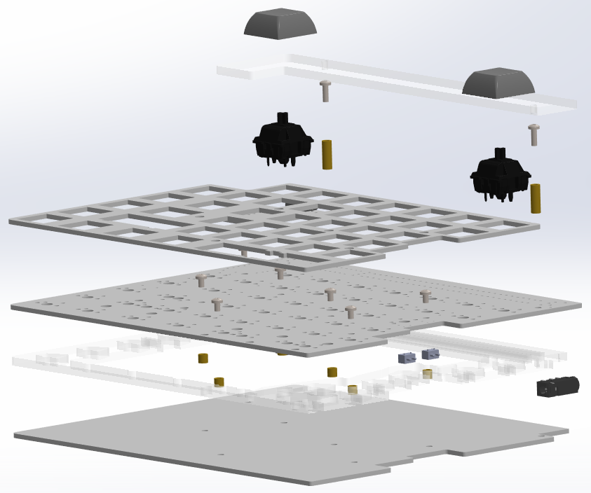

⚠️ **¡Importante!** Las notas marcadas con este icono son cruciales, asegúrate de leerlas con atención antes de continuar.

⚠️ **Pide ayuda!** Si en algún momento durante el montaje algo te parece confuso, te atascas, o no tienes claro si lo que estás haciendo es correcto, o bien no sabes que hacer a continuación... ¡pide ayuda! La mayoría de veces, las dudas son resueltas en discord o por correo en menos de unas pocas horas. ¡Es mejor preguntar cosas que podrían parecer estúpidas a cometer un error!

Los pasos marcados [OPCIONAL] no son necesarios para el kit básicos, pero podrían ser necesarios en función de qué decidas incluir en tu teclado.

## 1. [OPCIONAL] Soldadura de LEDs de debajo de la placa

[Contenido recomendado: Como soldar LEDs SMT 5050](https://electronics.stackexchange.com/questions/482626/how-to-solder-ws2812b-ledsindividual-not-a-strip-to-a-pcb)

Suelda los 10x WS2812B LEDs de luz ambiental, 5x en cada mitad del teclado. Empieza por una de las esquinas, y después las otras 3. Después de soldar, limpia con alcohol.

⚠️ **¡La dirección importa!** Estas piezas tienen una pequeña marca en ángulo que debe colocarse sobre la marca pintada en la placa. Si no las orientas correctamente, los LEDs no funcionarán y tu teclado pordría no encenderse.

⚠️ **Problemas con LED** Si has soldado los LEDs, pero tienes problemas (no se iluminan, dan colores aleatorios, parpadean, o solamente se encienden algunos de ellos), por favor sigue la sección LEDs en [Resolución de problemas](#troubleshooting), o revisa la [Guía de diagnóstico LED](../accessories/ws2812b_led_debug_docs.md).

| 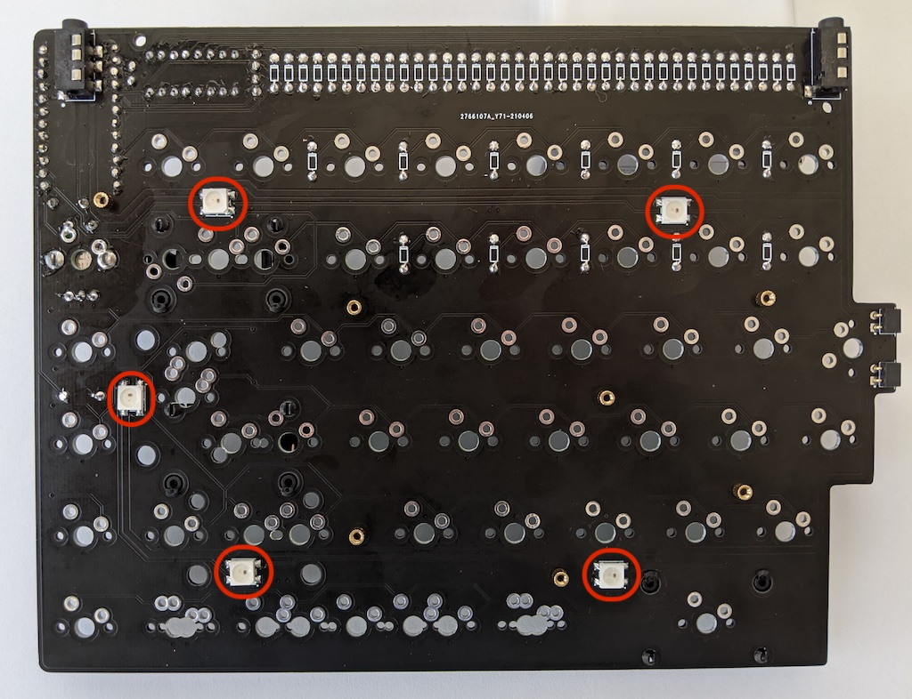 |  |
| --- | --- |

## 2. Doblando y soldando resistencias

Dobla y suelda la R1 en cada mitad del teclado.

|  |  |
| --- | --- |

Después de soldar, limpia con alcohol y usa las alicates de corte para enrasar las conexiones a la placa lo máximo posible.

## 3. Soldando interruptores de reinicio

Encaja y suelda el interruptor de reinicio en cada mitad de teclado tal como se muestra.

|  |  |
| --- | --- |

Después de soldar, limpia con alcohol.

## 4. Soldando sockets de los circuitos integrados

Encaja y suelda los dos sockets de IC, one en cada mitad de teclado. Haz coincidir la marca en el conector con la marca de la placa. Después de soldar, limpia con alcohol. **Nota: si accidentalmente sueldas uno o ambos sockets del revés, ¡no te preocupes! Los conectores son componentes pasivos y funcionarán de igual modo en cualquiera de las dos orientaciones. La orientación de los IC es lo que realmente importa, de manera que asegúrate de insertarlos en la orientación correcta después cuando los montes**

⚠️ **¡No sueldes los sockets con los IC montados!** El calor podría dañar el chip is está en el socket durante la soldadura.

| 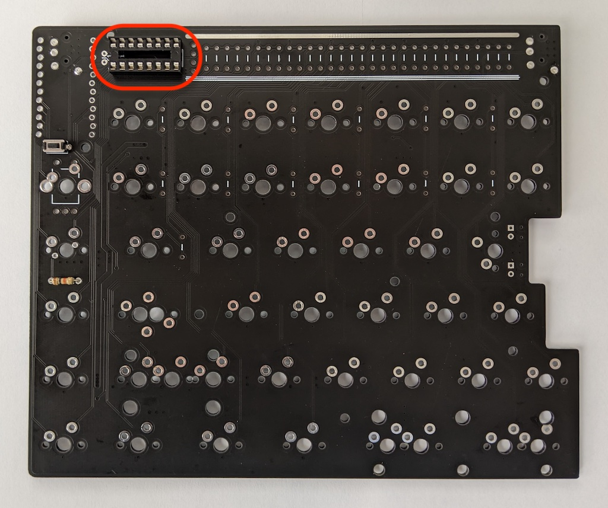 |  |
| --- | --- |

## 5. Soldando condensadores

Encaja y suelda ambos condensadores, uno en cada mitad de teclado.

|  |  |
| --- | --- |

Después de la soldadura, limpia con alcohol y usa las alicates de corte para enrasar la soldadura lo máximo posible a la placa.

## 6a. Dobla y suelda los diodos bajo las teclas

Hay algunos diodos que no se montan en el grupo principal en la parte superior del teclado: **13** en la mitad izquierda y **11** en la mitad derecha. Doble y encaja uno de los diodos 1N4148. Dobla las patas hacia dentro para que se sostengan en su lugar cuando des la vuelta a la placa. Empieza por soldar uno de los dos lados del diodo y retoca la alineación a tu gusto antes de soldar la segunda pata.

⚠️ **¡La orientación importa!** ¡Estos van en la parte **SUPERIOR** de la placa! Suelda los diodos con la línea negra **ARRIBA** tal como se muestra en las imágenes. El teclado no funcionará si los montas del revés.

|  | 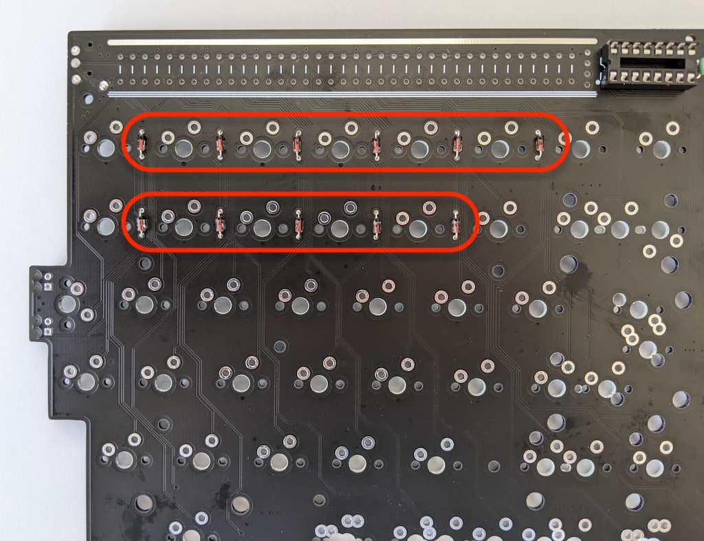 |
| --- | --- |

## 6b. Bend and solder top row of diodes

Bend and fit the remaining 1N4148 diodes for the top row. Bend the leads inward to hold the diodes in place when the PCB is turned upside down. Begin by soldering one side of the diodes and adjust the diode alignment to your liking before soldering the second lead.

⚠️ **Orientation matters!** These go on the **TOP** side of the PCB! Solder the diodes with the black bar **UP** as shown in the images. The keyboard will not work if they are backward.

|  |  |
| --- | --- |

After soldering all diodes, clean with rubbing alcohol and use the snips to clip the leads as close to the PCB as possible.

## 7. Solder TRRS Jacks

Solder all 4 TRRS jacks (two  keyboard side) in the locations shown. After soldering, clean with rubbing alcohol.

| 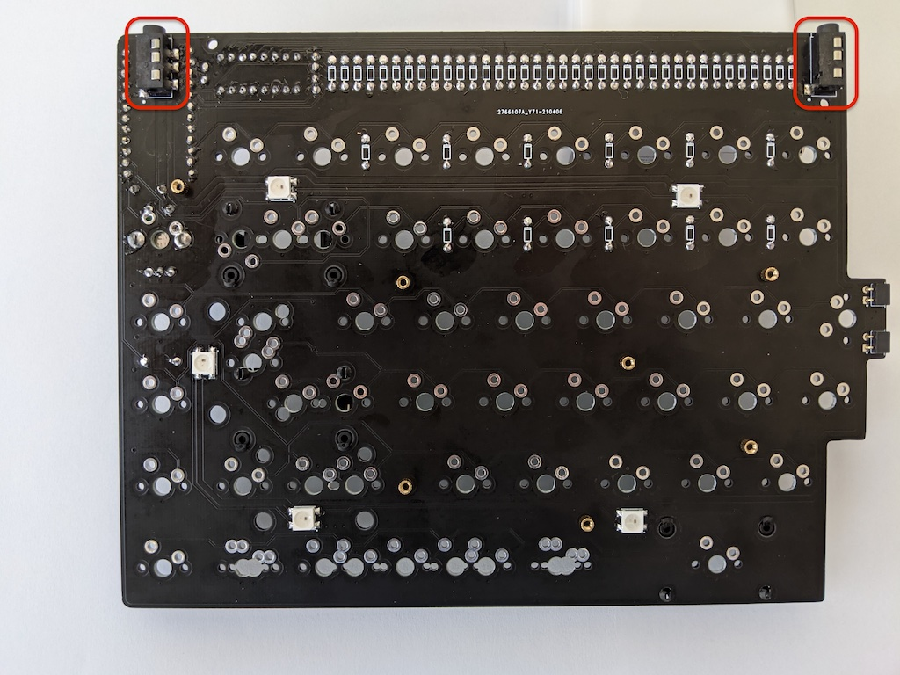 |  |
| --- | --- |

## 8. Solder Pogo Pins

**Pay close attention!** The pogo pins go on the bottom side of the PCBs! Look closely at the images below. Don't accidentally solder them on the wrong side of the PCB! In addition, the pogo pins are gendered. The male pogo pins mate with the female pogo pins, so double check that you have them on the correct sides before soldering.

|  |  |
| --- | --- |
|  |  |

Solder the included pogo pins on the **Bottom Side** of the PCB (same side as the optional LEDs). The male pogo pins go on the **left** half of the keyboard, and the female pins go on the **right** half.

# ⚠️ **STOP** ⚠️

It&#39;s highly recommended that you flash the MCU (Bit-C or Pro Micro) before soldering it so you can be sure it&#39;s working properly. [Jump to step](#firmware_flashing) 22 to flash QMK firmware.

## 9. Solder MCU

Use header pins to solder the MCUs to the keyboard. Fit and solder the BIT-C or Pro Micro MCU as shown below using 0.1" male header pins. After soldering, clean with rubbing alcohol and use the snips to clip the pins as close to the PCB as possible.

|  | 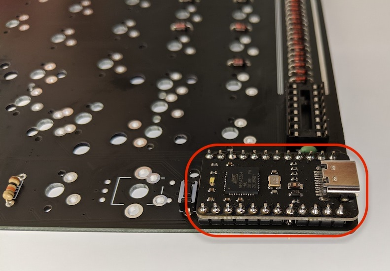 |
| --- | --- |

## 10a. [OPTIONAL] Solder rotary encoder(s)

If building with the optional rotary encoders, fit and solder one in each desired position(s) shown. One rotary encoder can be installed directly below the MCU on each side of the board. After soldering, clean with rubbing alcohol and use the snips to clip the pins as close to the PCB as possible. Note that it is **not** necessary to solder the large side support pins on the rotary encoder. **Do not clip the large support pins on the encoder.**

|  |  |
| --- | --- |

## 10b. [OPTIONAL] Solder speaker

If building with the optional speaker, fit and solder it in the position shown. The speaker is installed on the left side of the board.  After soldering, clean with rubbing alcohol and use the snips to clip the pins as close to the PCB as possible.

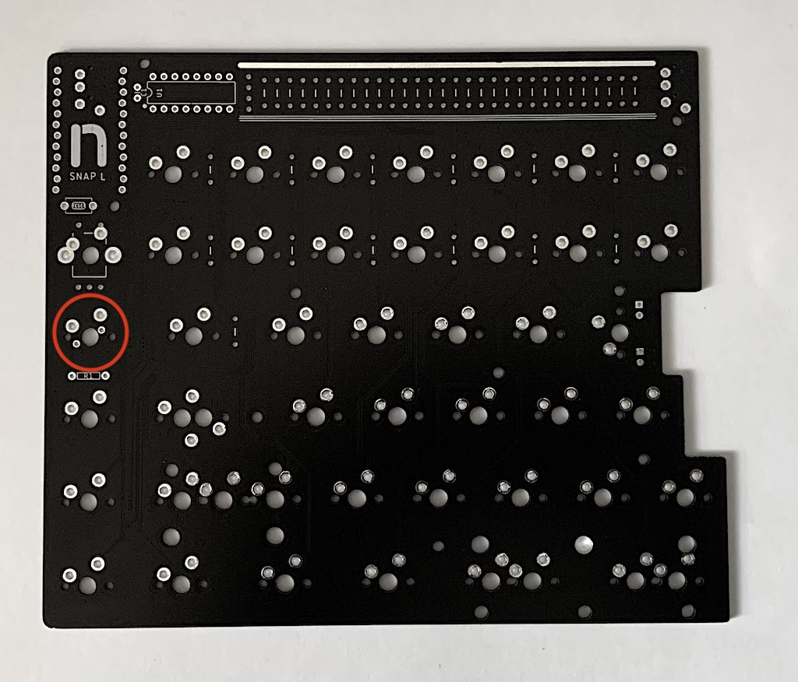

## 10c. [OPTIONAL] Solder OLED(s)

If building with the optional OLED displays, fit and solder each in the position each shown. One OLED can be installed on each side of the board above the diodes. After soldering, clean with rubbing alcohol and use the snips to clip the pins as close to the PCB as possible.

| 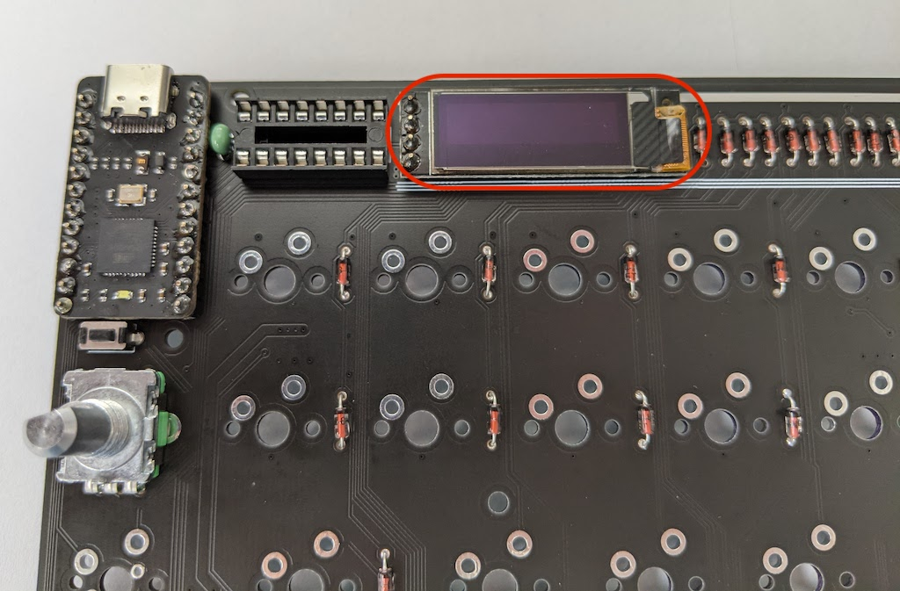 |  |
| --- | --- |

## 11. Insert ICs into IC sockets

⚠️ **Orientation matters!** Make sure that the side of the IC with the round mark is closest to the Bit-C on the left half and furthest from the Bit-C on the right half (both facing left) before inserting. Double check the images below before inserting if you're not sure! The  orientation should match the silkscreen.

Carefully bend the IC leads inward so that they are the width of the socket. It helps to set the IC on its side on a flat surface and use a tool to bend all leads at once.

While supporting the back of the PCB with one hand, push on the top of the IC using your thumb until it sits flush in the socket. If you feel leads bending, stop and carefully straighten them before continuing.

| 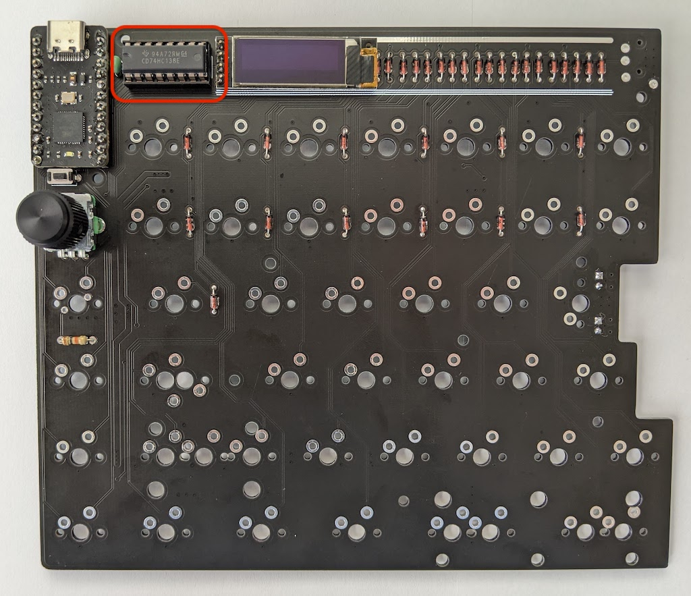 | 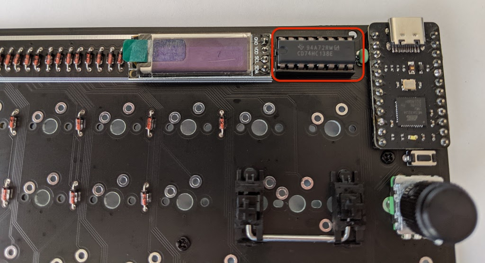 |
| --- | --- |

## 12. Choose key layout and configuration

The SNAP PCB includes guide marks for the switches and stabilizers to make their placement easier. The center of each switch lines up with a letter for a particular layout. The tables below show which markings to follow based on key configuration. Familiarize yourself with the [standard layout](http://www.keyboard-layout-editor.com/#/gists/bd48e2fe5b0f571c0034f27cb328d2d7) before soldering. The color coding and markings in the link above match the table below, so refer back to that if needed.

⚠️ **Compatibility note:** Not all combinations are compatible with each other! See the compatibility notes in the table. Double-check that the chosen configuration matches your keycaps before soldering.

**Caps lock (light yellow)**
| **Guide Mark** | **Layout Option** |
| --- | --- |
| A | Stepped 1.75U caps lock |
| B | Standard 1.75U caps lock |

**Left shift (dark yellow)**
| **Guide Mark** | **Layout Option** |
| --- | --- |
| C | 2.25U left shift + stab |
| D | 1.25U/1U (ISO) left shift |

**Spacebar (light green)**
| **Guide Mark** | **Layout Option** |
| --- | --- |
| E | 1.25U Fn, 2.25U spacebar + stab |
| F | 2.25U spacebar + stab, 1.25U Fn |

**Right modifiers (purple)**
| **Guide Mark** | **Layout Option** |
| --- | --- |
| G | 5x 1U modifiers + arrows |
| H | 4x 1.25U modifiers and no arrows |

**Right shift (dark green)**
| **Guide Mark** | **Layout Option** |
| --- | --- |
| I | 1.75U + 1U shift + up arrow |
| J | 2.75U shift + stab |

**Enter key**
| **Guide Mark** | **Layout Option** |
| --- | --- |
| K | 1.25U + 1U ISO + stab |
| L | 2.25U ANSI + stab |

**Backspace**
| **Guide Mark** | **Layout Option** |
| --- | --- |
| M | 2U + stab |
| N | 1U + 1U split backspace |

# ⚠️ **STOP** ⚠️

It&#39;s highly recommended that you test each key at this point before continuing. If you haven&#39;t already, [Jump to step](#firmware_flashing) 22 to flash QMK firmware. Use a keyboard tester ([this one](https://www.keyboardtester.com/) works) and short the switch pads for each switch using tweezers, a clipped lead from earlier, or something else conductive. If there is an issue, it will be much easier to debug now before everything has been soldered and assembled.

## 13. Screw together M2x3 standoffs using M2x3 screws

In the locations shown, screw the M2x3 standoffs into the bottom side of the **TOP** PCB plate. Fasten using 14 M2x3 screws (7 on each half). Use pliers to hold the standoff steady while tightening the screw. **Do not overtighten!** This step is extra important if you are building with a plate, since it's more difficult to access the screws with the plate in place, so double check this! The standoffs go on the bottom side of the board.

|  | 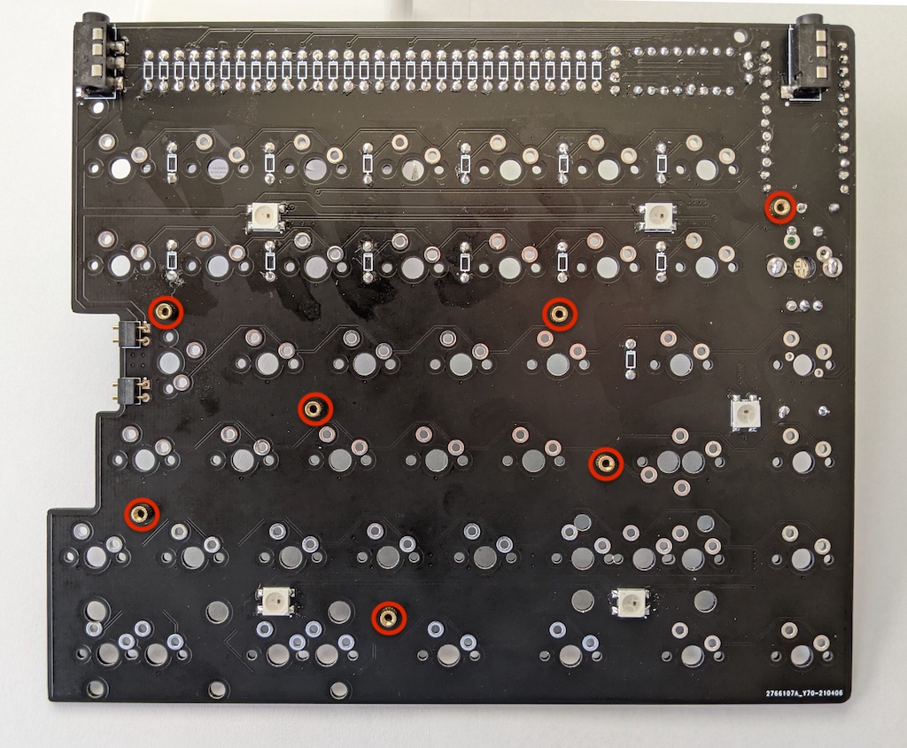 |
| --- | --- |

## 14. Snap in stabilizers

Snap in the PCB-mount stabilizers as shown below. The tab goes in the big hole, and the retaining clips go in the small holes. The stabilizers will only snap in one way. Make sure the stabilizer is fully seated, or the keycap won&#39;t move properly once it&#39;s installed. If using screw-in stabilizers, do **not** use the included washer between the screw and the PCB. The acrylic will not seat properly on top of the washer.

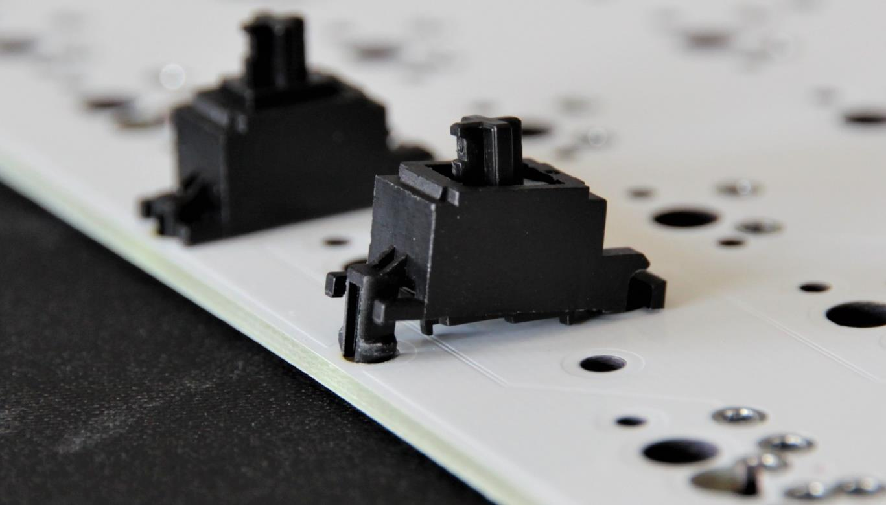

## 15. [OPTIONAL] Insert hot-swap sockets

If building with hotswap sockets, drop one into each plated lead hole and affix with tape (masking or electrical tape works well). Alternatively, insert them onto each lead of the PCB mount switch before proceeding.

## 16. Snap in switches

⚠️ **Stop!** Test fit your keycaps to make sure that the switch spacings are correct before soldering, especially the bottom row.

If you are using 5-pin PCB mount switches, they may take some force to insert. This is by design. For PCB mount switches, a tight fit makes the switches more stable. Snap in by supporting the back of the PCB, and then pushing hard on the top of the switch. It helps to use a spare keycap on the switch to take some of the pressure off your thumb. After snapping the switch in, make sure it&#39;s sitting flush against the PCB.

Note that some of the switches go in "sideways" and "upside down". This is by design! T, Y, \\, Enter, Backspace, and Caps Lock are all switches that might be installed in different orientations.

If building with hotswap sockets and a switch plate, you will need to remove the switches from the sockets after soldering in order to fit them into the plate for final assembly.

## 17. Solder switches or hot-swap sockets

⚠️ **Stop!** If you are building with a switch plate, make sure that you have installed and tightened the mounting hardware ( **Step 3.13** ) and installed the stabilizers ( **Step 3.14** ) before continuing! Once the switches are installed on the plate, access to the items below is difficult.

Make sure each switch pin has enough solder to form a nice solid joint.

|  | 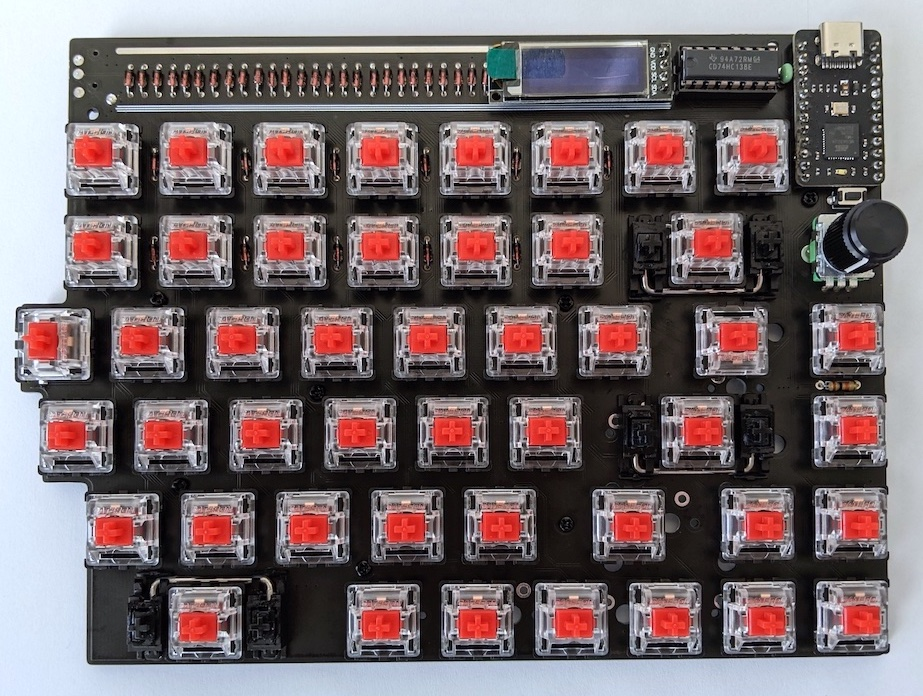 |
| --- | --- |

If building with hotswap sockets and a switch plate, after soldering, insert switches into the switch plate before installing on the PCB. It helps to seat switches in the corner positions on the plate, then insert into the sockets, then insert the remaining switches into the plate and sockets. The plate may have holes, but is not attached to the rest of the board with any screws or standoffs. The holes are for accessing the screws below the switch plate.

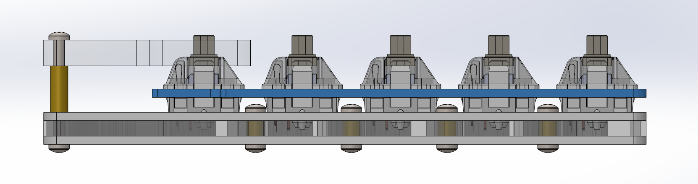

## 18a. Prepare and attach magnets to acrylic

The SNAP uses magnets affixed to the acrylic support layers in order to hold the two sides together when the pogo pins are used. The magnets are held in place with the thin, clear magnet stickers, but can also be fastened with glue (CA, epoxy, or hot glue) for a more secure and permanent solution. If using glue to secure the magnets, double (actually, triple!) check that the magnets for the left and right side are in the correct orientation and attract each other!

The magnets install in sets of two in the acrylic cutouts as shown below. Note that the paper backing should be removed before this step, but is shown on the acrylic for higher contrast and better visibility.

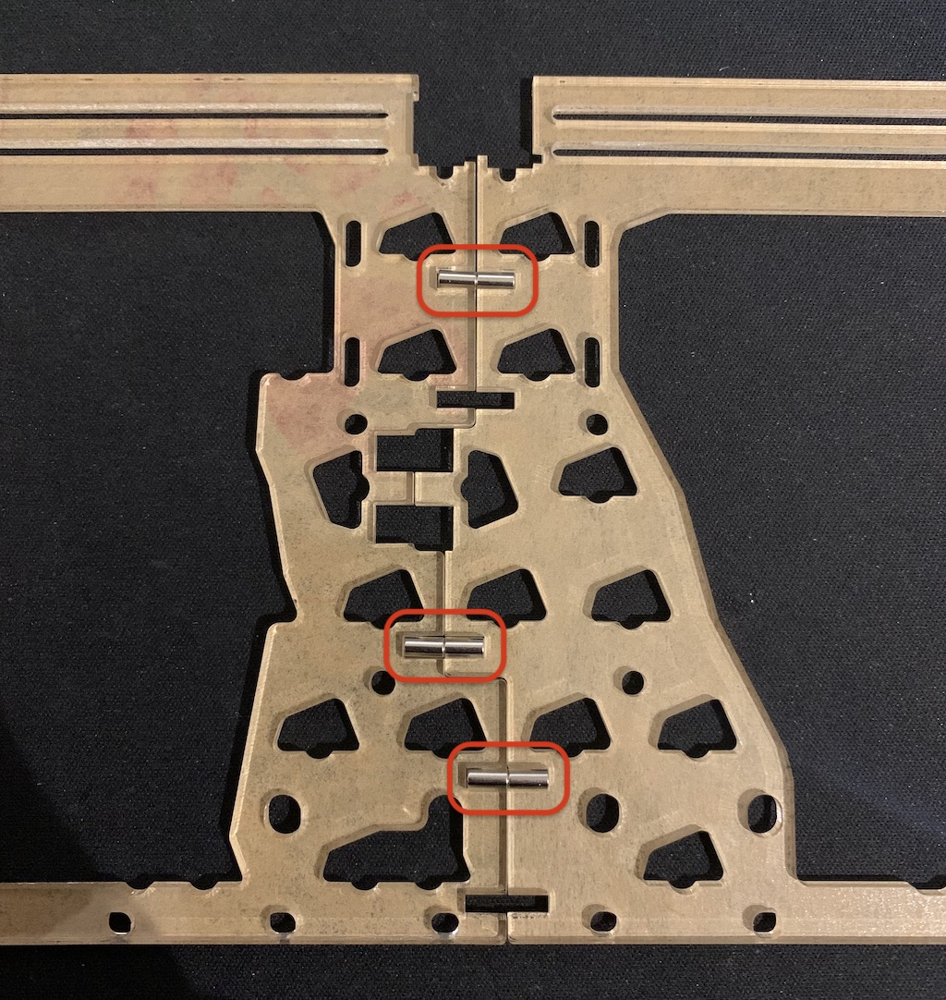

To install the magnets, first cut the clear magnet stickers in half and split the magnets into pairs of two.

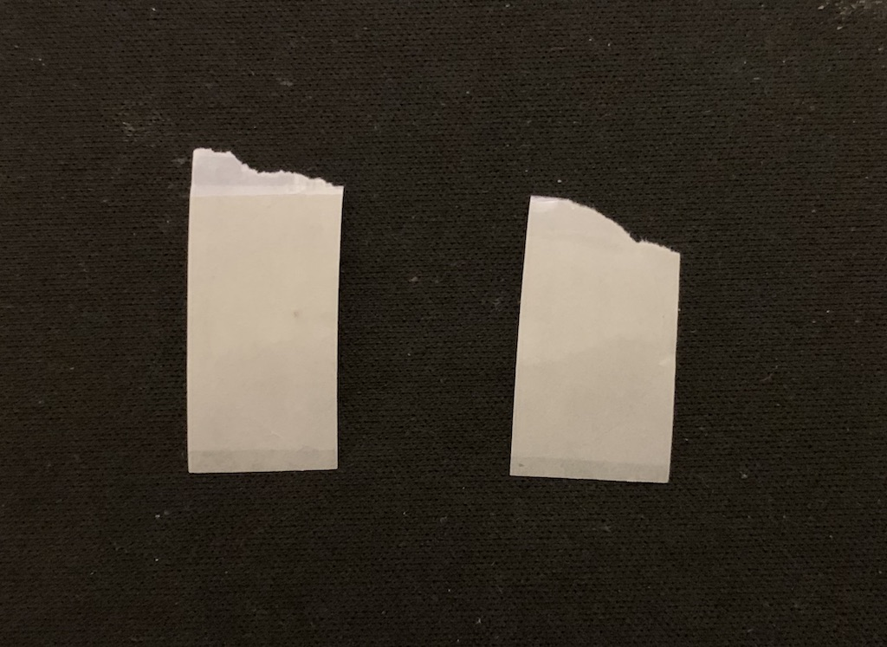

Then, unpeel one sticker half and place the end of a magnet on the center of the sticky part of the sticker.

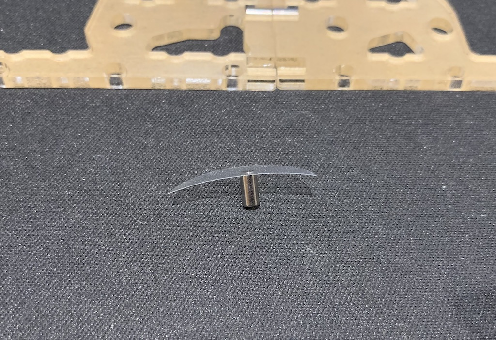

With the acrylic off the board, align the magnet with the center of the cutout, and stick the front face of the sticker onto the acrylic.

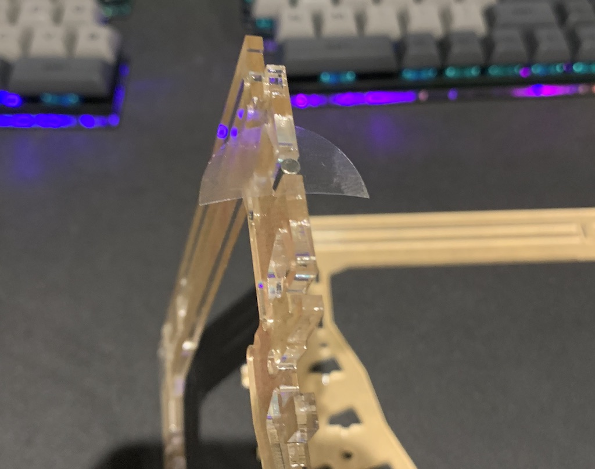

Tightly both sides of the magnet sticker over so that it holds the magnet in place.

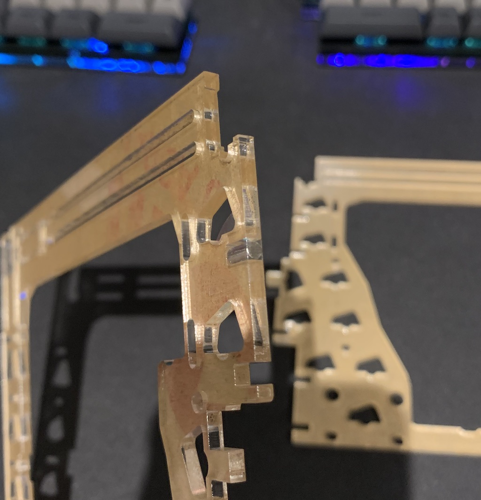

Do this for three of the notches on the left side of the board first, and then the same on the right side of the board. Make sure to set check that the magnets on the right side are attracted to the ones on the left side before sticking them on with the stickers.

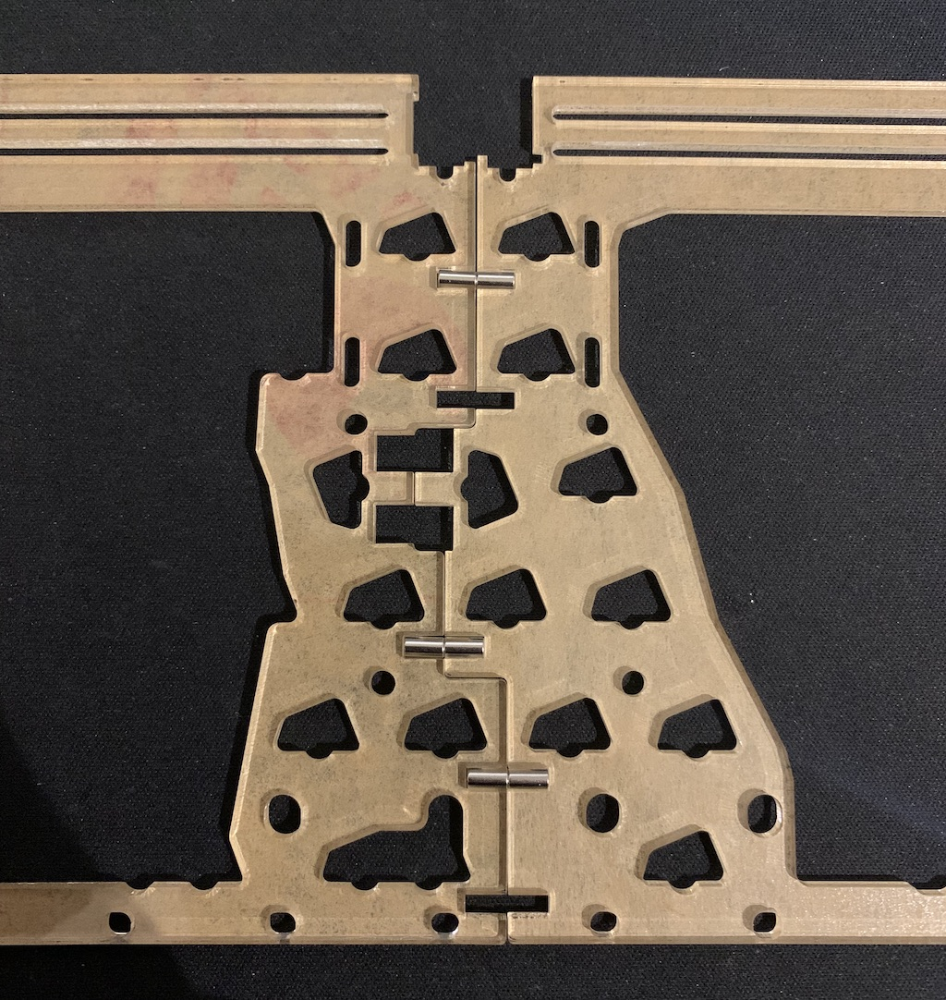

Test fit the acrylic before the next step to make sure all sets of magnets snap and hold the two sides tightly together, and don't repel each other. If any of the magnet pairs are in the wrong orientation and are not attracting each other, carefully unpeel the sticker holding one of the magnets in place and reverse the orientation before continuing.

|  |  |
| --- | --- |

## 18b. Slide the acrylic spacer onto the standoffs

Peel the backing material off the acrylic spacer. Make sure the acrylic spacer sits flat against the PCB plate. Check for interferences due to leads or solder joints. Trim if needed.

|  |  |
| --- | --- |

## 19. Fasten the bottom with M2x3 screws

Place the bottom PCB plate on top of the acrylic spacer. In the same locations where the 14 standoffs were installed, fasten with 14 M2x3 screws (7 on each half). **Do not overtighten!**

| 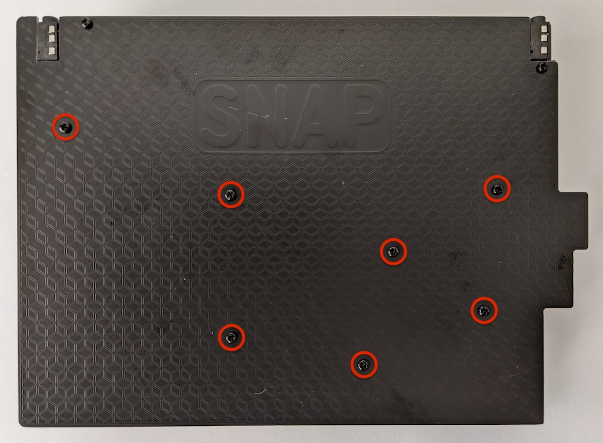 | 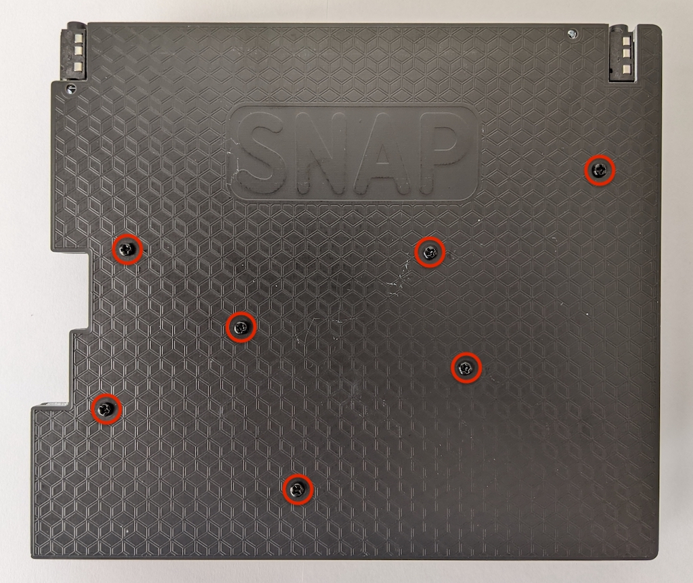 |
| --- | --- |

## 20. Fasten M2x10 standoffs from bottom using M2x10 screws

Fasten using 2 M2x10 screws. Use pliers to hold the standoff steady while tightening the screw.

|  |  |
| --- | --- |

## 21. Attach the top guard using M2x6 screws

Fasten using 2 M2x6 screws. Don&#39;t overtighten these, as it can crack the top guard.

| 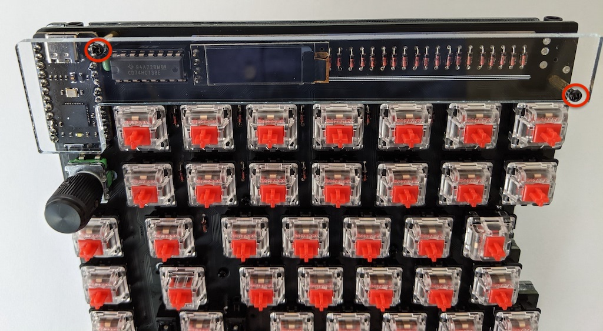 |  |
| --- | --- |

## 22.  Flash firmware using QMK toolbox

Download either a precompiled binary (only if using a Pro Micro or BIT-C) or the QMK source files from [GitHub](https://github.com/nullbitsco/firmware). Using [QMK Toolbox](https://qmk.fm/toolbox/), flash the firmware onto the keyboard. For more information, follow the [Firmware flashing guide](https://github.com/nullbitsco/docs/blob/main/firmware/firmware_flashing.md)

Heads up: both sides of the keyboard need to be flashed for it to work!

## 23. Install keycaps and enjoy!

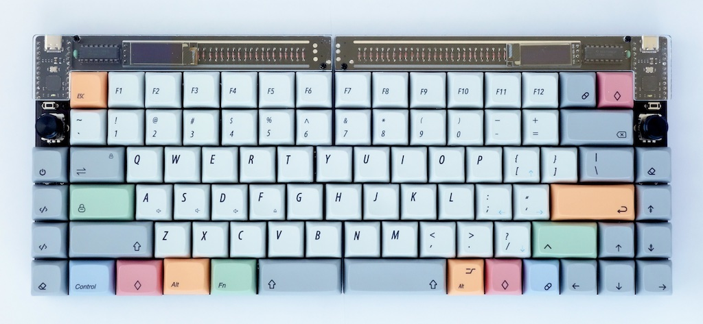

#  4. Troubleshooting

Helpful reference pinouts:  
[MCU Pinout (Left)](build_guide_img/image082.jpg)  
[MCU Pinout (Right)](build_guide_img/image083.jpg)  
[OLED Pinout](build_guide_img/image084.jpg)

**None of the keys are working**

- Is the firmware loaded?
- Try with a different USB cable, USB port, and PC.
- If you soldered the LEDs, check that none have been soldered backward. The keyboard will not work if an LED was mistakenly soldered backward.
- Check the direction of the diodes. The back bar should be facing upwards.
- Check the direction of the ICs. The keyboard will not work if they are in the socket backward.
- Check that there are no shorts and that the keyboard is powering up properly. None of the solder joints should be touching each other.

**A single key is not working**

- Check that the switch is soldered properly at both pins.
- Bypass the switch by shorting the two pads with tweezers. If that works, the switch is to blame and should be replaced. If it does not, the diode soldering is likely the issue. You can use the [diode key](https://nullbits.co/static/file/SNAP_diode_key.pdf) to match diodes with a switch!
- Check that all of the diodes are soldered properly at both pins.
- Check that the keymap you are using is defined correctly and matches your keyboard layout.

**A whole row is not working**

- This is usually caused by a cold solder joint at the MCU. Check that all pins on the MCU are soldered properly.
- Check that the proper rows and columns are set in QMK config.h

**A whole column is not working**

- Check that all pins on the MCU are soldered properly.
- Check that the proper rows and columns are set in QMK config.h
- Check that all pins on the ICs are soldered properly.

**The rotary encoder is not working**

- Check that all pins on the rotary encoder are soldered properly.
- Check that the A and B pins are set in QMK config.h and that ENCODER\_ENABLE = yes in QMK rules.mk.

**The OLED is not working**

- Check that all pins on the OLED are soldered properly.
- The OLED is not enabled in the default firmware. Load the 'oled' firmware, available on the QMK repo.

**Two or more keys are swapped**

- Check that the keymap you are using is defined correctly and matches your keyboard layout.

**The underglow LEDs are not working**

- Check that the RGB\_DI\_PIN pin is set in QMK config.h and that RGBLIGHT\_ENABLE = yes in QMK rules.mk.
- Check that all LEDs are soldered in the proper orientation.

**There&#39;s no power**

- Check that all LEDs are soldered in the proper orientation.
- Check the direction of the ICs.
- Check for other shorts – solder blobs, leads that were not clipped all the way, etc.

**How to I do X in firmware?**

- See the QMK docs, or make a post on [r/olkb](https://www.reddit.com/r/olkb/) for help.
- Make a post on the [r/nullbits](https://www.reddit.com/r/nullbits/) subreddit, or join the #firmware channel in the [nullbits discord server](https://discord.gg/eSegJcY).

**Something else?**

- Visit [nullbits.co/support/](https://nullbits.co/support/)
- Reach out at [help@nullbits.co](mailto:help@nullbits.co)
- Join our [Discord](https://discord.gg/eSegJcY)!
