# SNAP

## Kit de Teclado Split 75%

## Guía de montaje

# Índice

[Enlaces útiles](#helpful_links)

[Componentes y herramientas](#parts_and_tools)

[Instrucciones de montaje](#assembly_steps)

[Solución de errores](#troubleshooting)

## ¡Gracias por la compra!
Nos sentimos honrados por el interés y pasión que NIBBLE y TIDBIT han recibido. Después de mucho investigar, iterar y mejorar, tenemos lo que esperamos sea una evolución aún más popular de ambos. El SNAP (esperamos) recoge lo mejor de ambos y añade un extra. Esperamos que disfrutes montando y usando este teclado tanto como nosotros.

#  1. Enlaces útiles

- [Perfil por defecto](http://www.keyboard-layout-editor.com/#/gists/bd48e2fe5b0f571c0034f27cb328d2d7)
- [Firmware QMK](https://github.com/nullbitsco/snap)
- [Habilidades básicas: Soldadura](https://www.youtube.com/watch?v=UpVx4wGukRc) - ¡Asegúrate de estar preparad@ para soldar tu kit de teclado!
- [¡Revisa](build_guide_img/image048.png) la calidad de tus [soldaduras!](build_guide_img/image049.png)
- [Como usar un multímetro](https://www.youtube.com/watch?v=SECWePatYjY) - ¡Importante para diagnosticar problemas!
- [Guía para flashear firmware](https://github.com/nullbitsco/docs/blob/main/firmware/firmware_flashing.md)

#  2. Componentes y herramientas

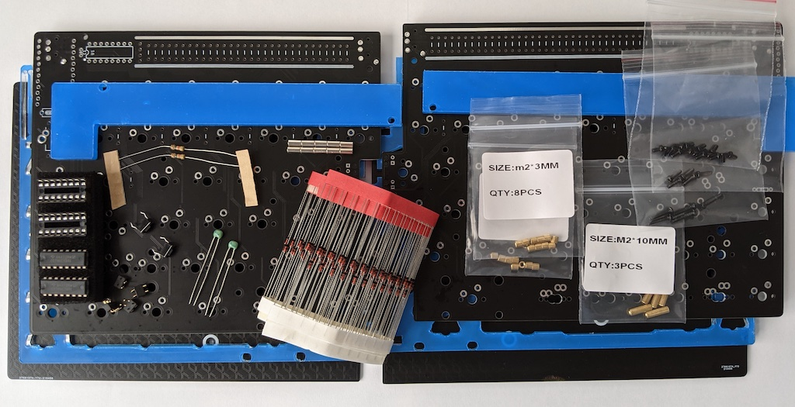

## 1. Piezas incluidas en el kit

### Tornillos

| **Item** | **Cantidad** | **Imagen** |
| --- | --- | --- |
| Standoff (separador), M2x3 | 16 | 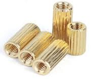 |
| Standoff (separador), M2x10 | 6 | 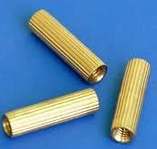 |
| Tornillo, M2x3 | 30 |  |
| Tornillo, M2x6 | 6 | 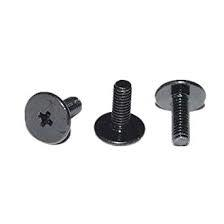 |
| Tornillo, M2x10 | 6 | 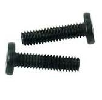 |
| Machined Knob (rueda) | 1 |  |

### Electrónica

| **Item** | **Cantidad** | **Imagen** |
| --- | --- | --- |
| 1N4148 Diodo | 100 | 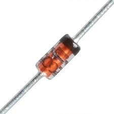 |
| 0.1μF Condensador | 2 | 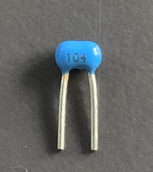 |
| 10KΩ Resistencia | 2 |  |
| IC Socket (conector IC) | 2 | 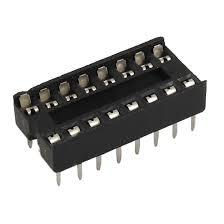 |
| IC (74HC138N) (circuito integrado) | 2 | 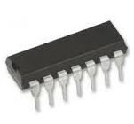 |
| Interruptor Reset | 2 |  |
| WS2812B LED | 10 |  | 
| TRRS Jack | 4 | 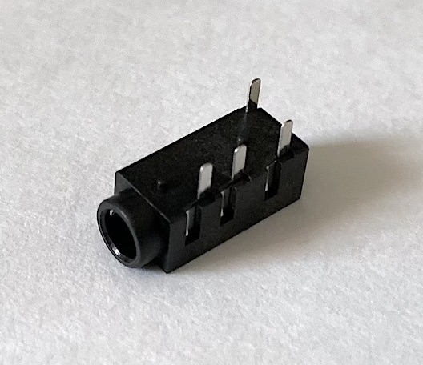 |
| Rotary Encoder (codificador giratorio) | 1 |  |
| PTH Altavoz | 1 |  |
| PTH Pogo Pins (male) | 2 |  |
| PTH Pogo Pins (female) | 2 | 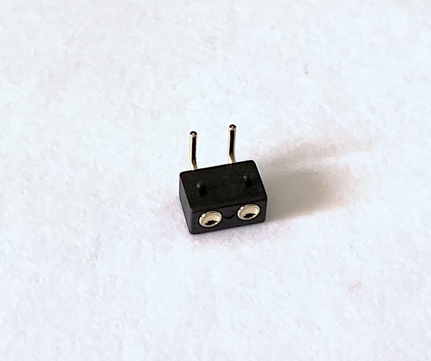 |
| 40-pin Breakaway Headers (conectores) | 2 |  |

### Estructura

| **Item** | **Cantidad** | **Imagen** |
| --- | --- | --- |
| Placa electrónica superior (PCB) (izquierda) | 1 |  |
| Placa electrónica superior (PCB) (derecha) | 1 |  |
| Placa inferior (izquierda) | 1 |  |
| Placa inferior (derecha) | 1 |  |
| Separador central de acrílico (izquierda) | 1 |  |
| Separador central de acrílico (derecha) | 1 |  |
| Tapa superior de acrílico (izquierda) | 1 | 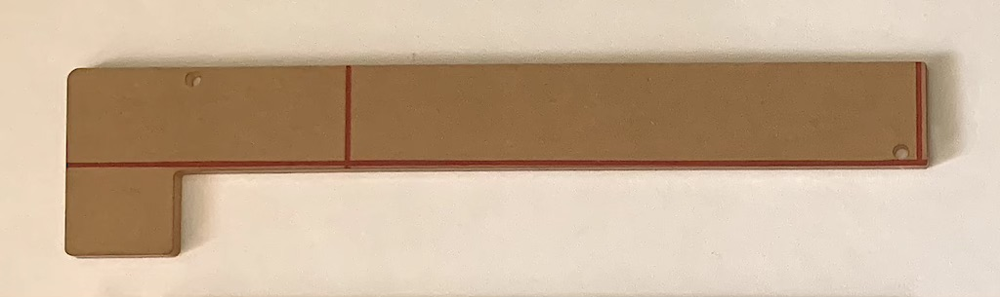 |
| Tapa superior de acrílico (derecha) | 1 | 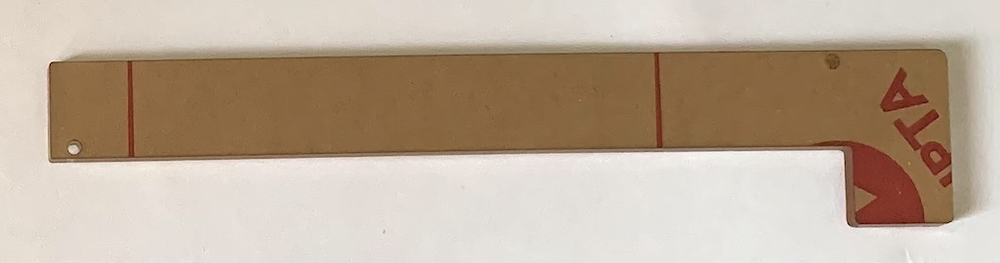 |

### Extras

| **Item** | **Cantidad** | **Imagen** |
| --- | --- | --- |
| Cable TRRS | 1 |  |
| Imanes 3x6mm | 6 | 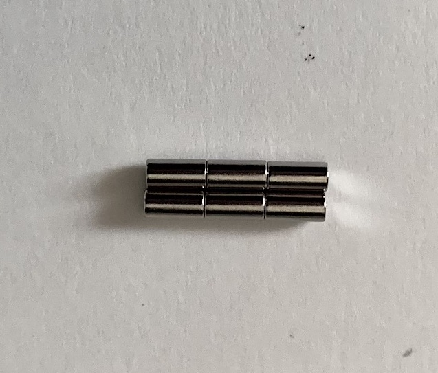 |
| Pegatinas para imanes | 6 | 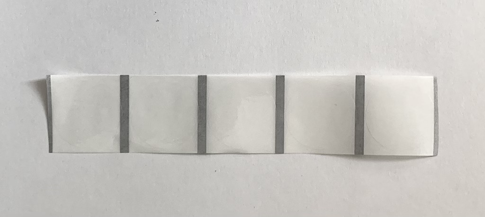 |
| Mini patitas | 8 |  |

## 2. Piezas no incluidas

- 2x [BIT-C](https://nullbits.co/bit-c/) u otro MCU compatible
- 92x switches PCB-mount (tipo Cherry MX)
- 5x 2U estabilizadores PCB-mount*. Sirven tanto los atornillados como de clip.
  - 2x 2U stabs - uno por cada barra espacsiadora.
  - 3x 2U stabs - para shift izquierdo, enter y borrar.
  - *[Opcional] - 1x 2U stab si vas a usar shift derecho de 2.75U.
- Keycaps
- **[OPCIONAL]** [Rueda extra (rotary encoder + knob)](https://amzn.to/3rOnY2l)
- **[OPCIONAL]** [Pantalla(s) OLED 0.91" 128x32](https://amzn.to/3wjHpmK)
- **[OPCIONAL]** [switch plate FR4](https://amzn.to/3IozdaE)
- **[OPCIONAL]** Mill-Max 0305, 3305, or 7305 hot-swap solder sockets

## 3. Herramientas necesarias

- Soldador de punta fina y estaño
- Alicates de punta fina
- Pinzas de punta fina
- Destornillador Phillips #0
- Alicates de corte para electrónica
- Alcohol para limpiar (isopropílico o el disolvente indicado para el estaño que uses)
- **[Recomendable]** Multímetro
- **[Recomendable]** Medidor de corriente USB

#  3. Guía de montaje

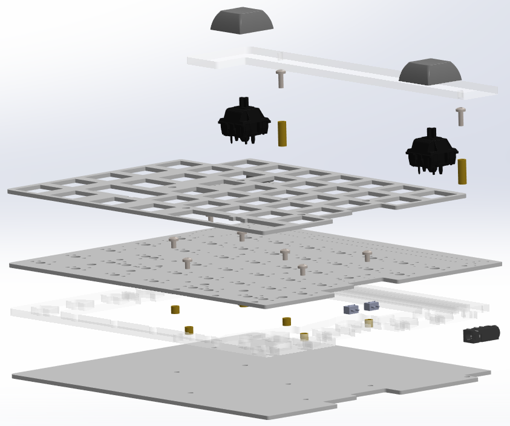

⚠️ **¡Importante!** Las notas marcadas con este icono son cruciales, asegúrate de leerlas con atención antes de continuar.

⚠️ **Pide ayuda!** Si en algún momento durante el montaje algo te parece confuso, te atascas, o no tienes claro si lo que estás haciendo es correcto, o bien no sabes que hacer a continuación... ¡pide ayuda! La mayoría de veces, las dudas son resueltas en discord o por correo en menos de unas pocas horas. ¡Es mejor preguntar cosas que podrían parecer estúpidas a cometer un error!

Los pasos marcados [OPCIONAL] no son necesarios para el kit básicos, pero podrían ser necesarios en función de qué decidas incluir en tu teclado.

## 1. [OPCIONAL] Soldadura de LEDs de debajo de la placa

[Contenido recomendado: Como soldar LEDs SMT 5050](https://electronics.stackexchange.com/questions/482626/how-to-solder-ws2812b-ledsindividual-not-a-strip-to-a-pcb)

Suelda los 10x WS2812B LEDs de luz ambiental, 5x en cada mitad del teclado. Empieza por una de las esquinas, y después las otras 3. Después de soldar, limpia con alcohol.

⚠️ **¡La orientación importa!** Estas piezas tienen una pequeña marca en ángulo que debe colocarse sobre la marca pintada en la placa. Si no las orientas correctamente, los LEDs no funcionarán y tu teclado pordría no encenderse.

⚠️ **Problemas con LED** Si has soldado los LEDs, pero tienes problemas (no se iluminan, dan colores aleatorios, parpadean, o solamente se encienden algunos de ellos), por favor sigue la sección LEDs en [Resolución de problemas](#troubleshooting), o revisa la [Guía de diagnóstico LED](../accessories/ws2812b_led_debug_docs.md).

|  |  |
| --- | --- |

## 2. Doblando y soldando resistencias

Dobla y suelda la R1 en cada mitad del teclado.

| 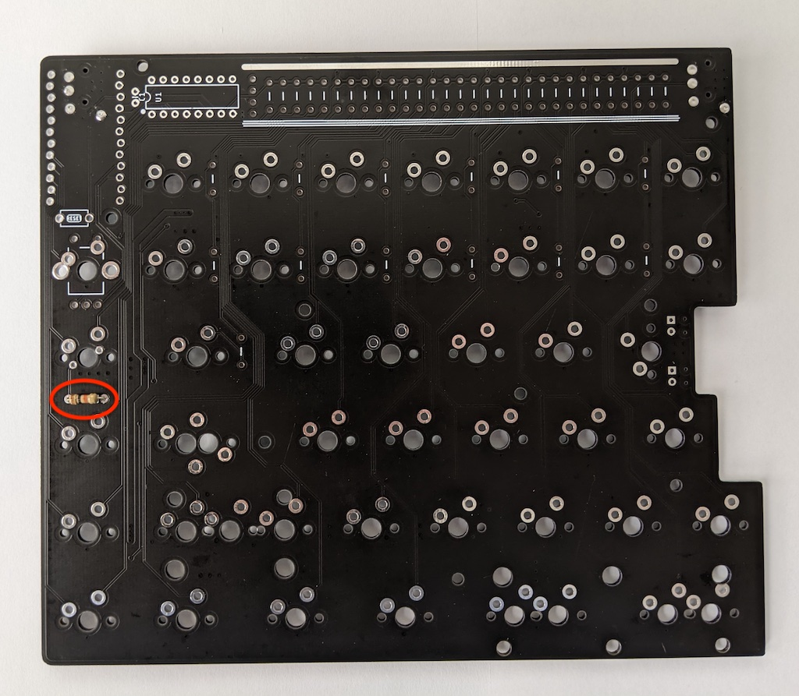 |  |
| --- | --- |

Después de soldar, limpia con alcohol y usa las alicates de corte para enrasar las conexiones a la placa lo máximo posible.

## 3. Soldando interruptores de reinicio

Encaja y suelda el interruptor de reinicio en cada mitad de teclado tal como se muestra.

| 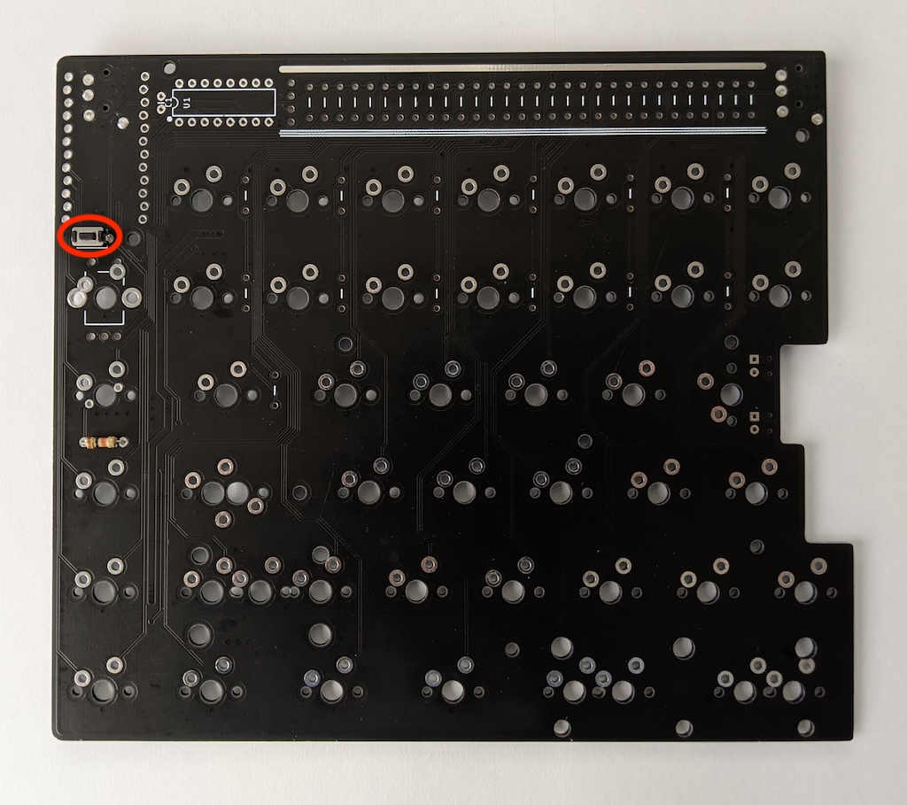 |  |
| --- | --- |

Después de soldar, limpia con alcohol.

## 4. Soldando sockets de los circuitos integrados

Encaja y suelda los dos sockets de IC, one en cada mitad de teclado. Haz coincidir la marca en el conector con la marca de la placa. Después de soldar, limpia con alcohol. **Nota: si accidentalmente sueldas uno o ambos sockets del revés, ¡no te preocupes! Los conectores son componentes pasivos y funcionarán de igual modo en cualquiera de las dos orientaciones. La orientación de los IC es lo que realmente importa, de manera que asegúrate de insertarlos en la orientación correcta después cuando los montes**

⚠️ **¡No sueldes los sockets con los IC montados!** El calor podría dañar el chip is está en el socket durante la soldadura.

|  |  |
| --- | --- |

## 5. Soldando condensadores

Encaja y suelda ambos condensadores, uno en cada mitad de teclado.

|  |  |
| --- | --- |

Después de la soldadura, limpia con alcohol y usa las alicates de corte para enrasar la soldadura lo máximo posible a la placa.

## 6a. Dobla y suelda los diodos bajo las teclas

Hay algunos diodos que no se montan en el grupo principal en la parte superior del teclado: **13** en la mitad izquierda y **11** en la mitad derecha. Doble y encaja uno de los diodos 1N4148. Dobla las patas hacia dentro para que se sostengan en su lugar cuando des la vuelta a la placa. Empieza por soldar uno de los dos lados del diodo y retoca la alineación a tu gusto antes de soldar la segunda pata.

⚠️ **¡La orientación importa!** ¡Estos van en la parte **SUPERIOR** de la placa! Suelda los diodos con la línea negra **ARRIBA** tal como se muestra en las imágenes. El teclado no funcionará si los montas del revés.

| 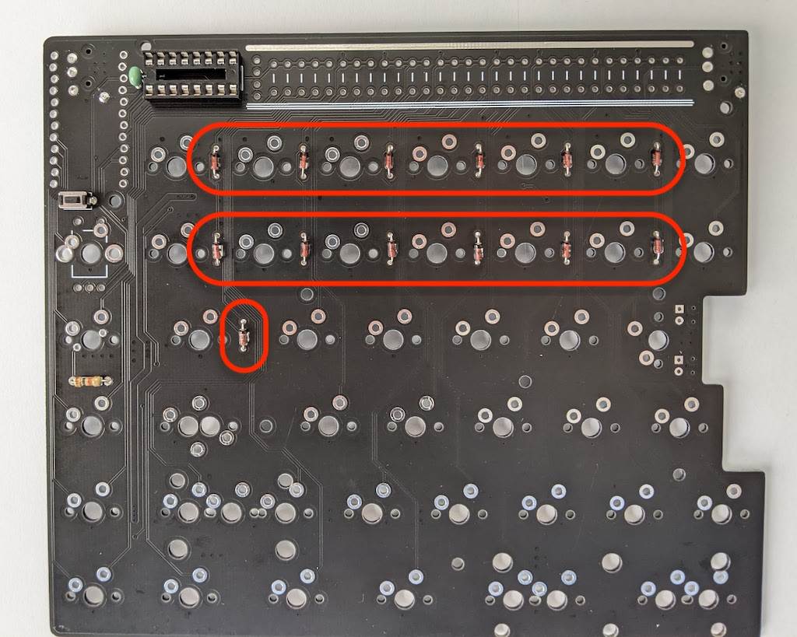 |  |
| --- | --- |

## 6b. Dobla y suelda la fila superior de diodos

Dobla y suelda los diodos 1N4148 restantes de la fila supeior. Dobla los cables hacia el interior para que los diodos se sostengan en la placa cuando de la vuelta a la placa. Empieza por soldar uno de los dos lados del diodo y retoca la alineación a tu gusto antes de soldar el segundo cable.

⚠️ **¡La orientación importa!** ¡Estos van en la parte **SUPERIOR** de la placa! Suelda los diodos con la línea negra **ARRIBA** tal como se muestra en las imágenes. El teclado no funcionará si los montas del revés.

|  | 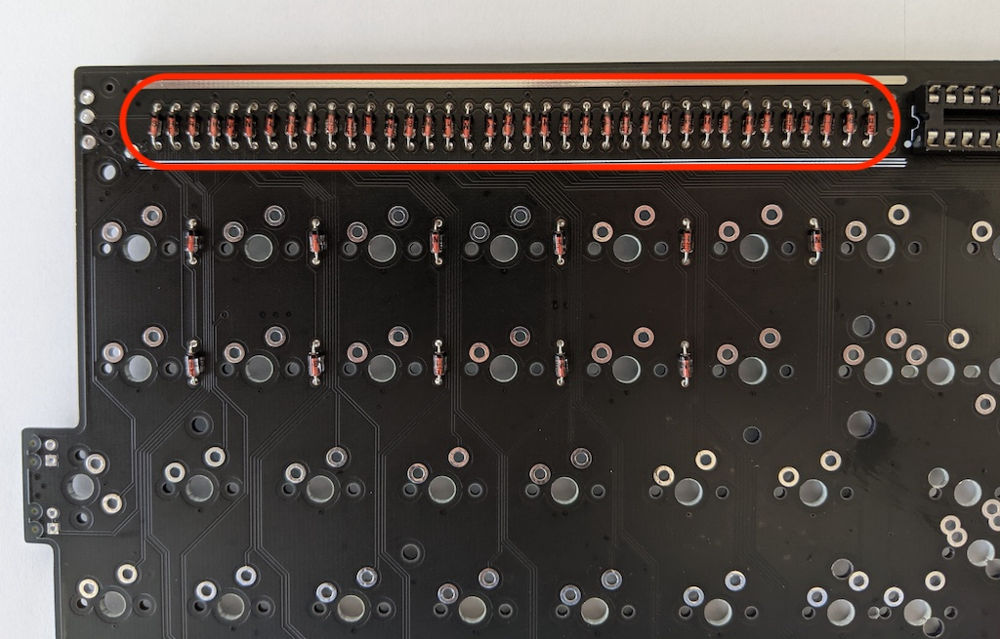 |
| --- | --- |

Después de soldar todos los diodos, limpia con alcohol y usa los alicates de corte para enrasar las conexiones tan cerca de la placa como sea posible.

## 7. Soldando los jacks TRRS

Suelda los 4 jacks TRRS (dos en cada mitad de teclado) en los lugares indicados. Después de soldar, limpia con alcohol.

|  | 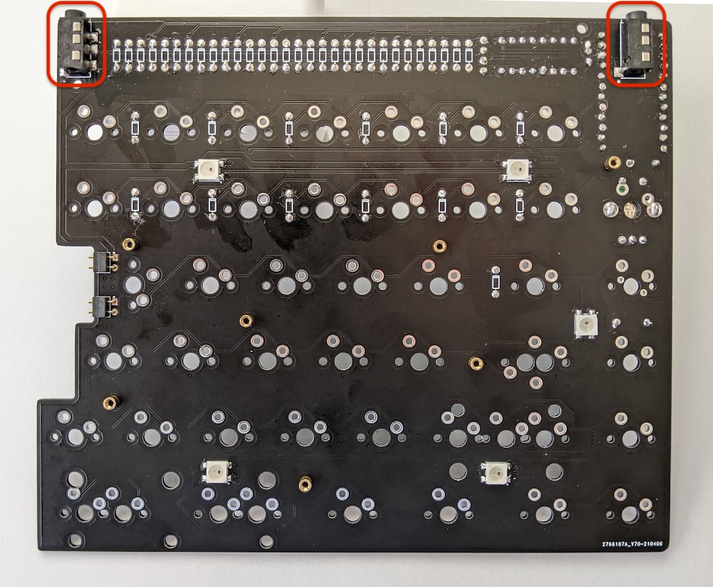 |
| --- | --- |

## 8. Soldando los Pogo Pins

**!Atención!** Los pogo pins van en la parte inferior de las placas! Mira con atención las imagenes a continuación. ¡No los sueldes accidentamente en el lado erróneo de la placa! Además, los pogo pin tienen género. El macho encaja con la hembra, así que revisa que estén posicionados correctamente antes de soldarlos.

|  | 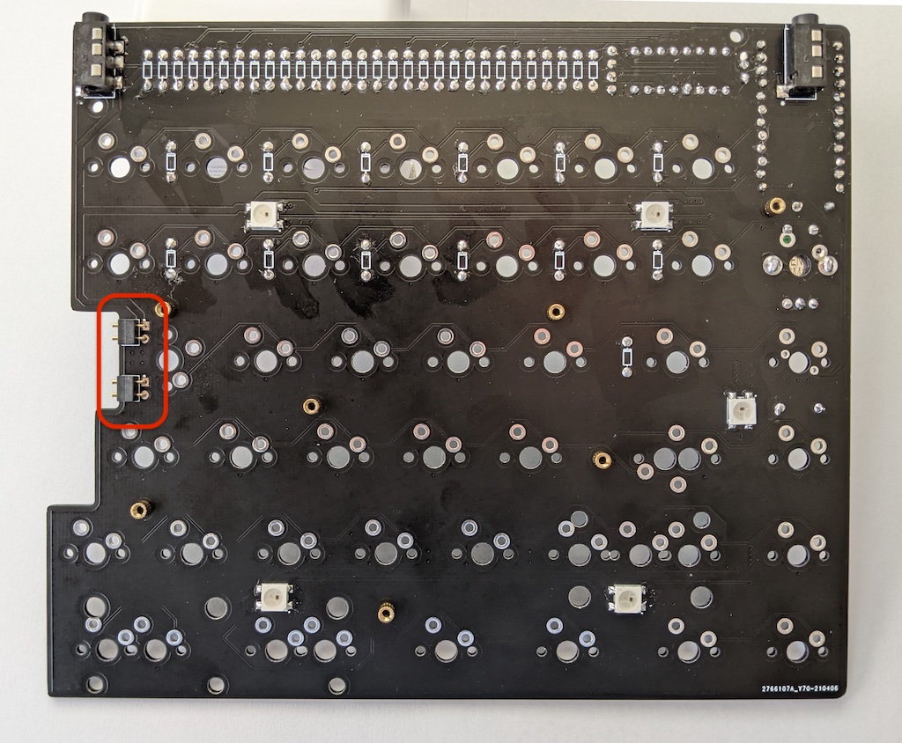 |
| --- | --- |
|  |  |

Suelda los pogo pins incluidos en el **Lado inferior** de la placa (mismo lado que los LEDs opcionales). Los pogo pins macho van a la mitad **izquierda** del teclado, y los hembra a la mitad **derecha**.

# ⚠️ **ESPERA** ⚠️

Se recomienda encarecidamente que flashees la MCU (Bit-C o Pro Micro) antes de soldarlas para que puedas asegurarte de que funcionan correctamente. [Salta al paso](#firmware_flashing) 22 para flashear firmware QMK.

## 9. Soldando MCU

Usa los conectores para soldar las MCUs al teclado. Encaja y suelda el BIT-C o Pro Micro MCU tal como se muestra a continuación usando pines macho de 0.1". 
Después de soldar, limpia con alcohol y usa las alicates de corte para enrasar las conexiones tan cerca de la placa como sea posible.

|  |  |
| --- | --- |

## 10a. [OPCIONAL] Soldando rotary encoder(s)

Si vas a usar los rotary encoders opcionales, encaja y suelda uno de ellos en cada uno de los posibles lugar indicados a continuación. Un rotary encoder puede ser instalado en la posición inmediatamente inferior a la MCU en cada mitad del teclado. Después de soldar, limpia con alcohol y usa las alicates de corte para enrasar lo máximo posible las conexiones a la placa. Nota: **no** es necesario soldar los dos soportes gruesos del encoder, es suficiente con encajarlos. **No recortes los soportes gruesos del encoder.**

| 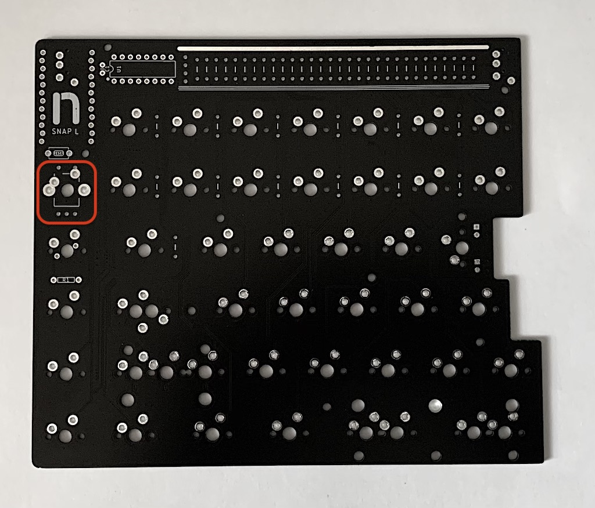 | 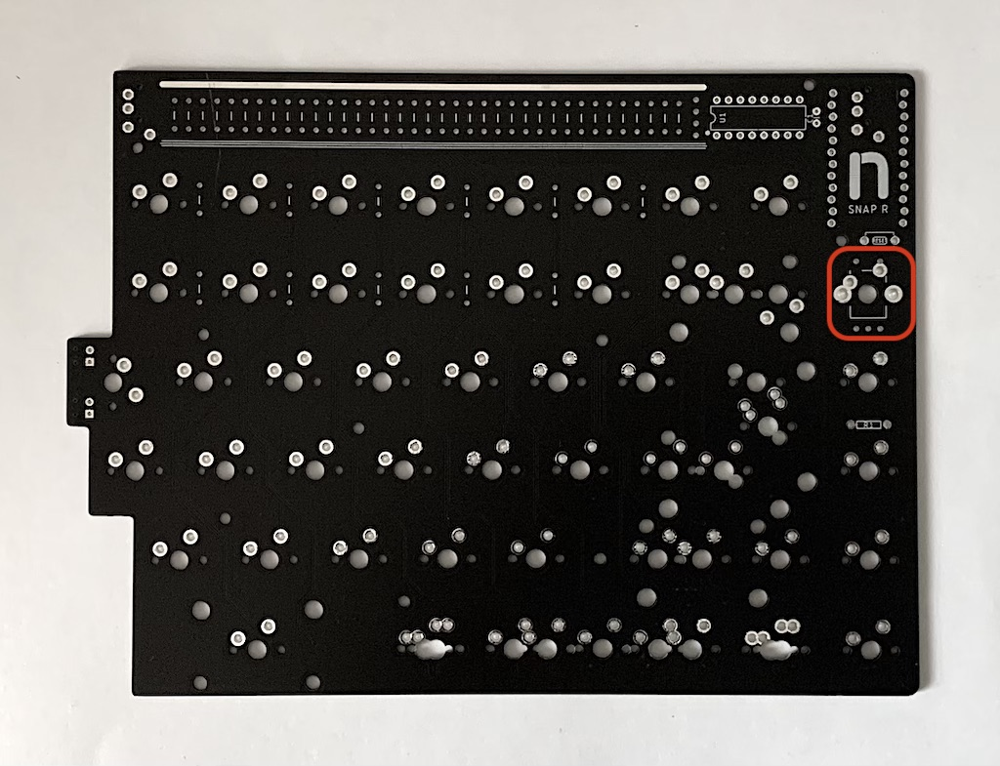 |
| --- | --- |

## 10b. [OPCIONAL] Soldando el altavoz

Si vas a usar el altavoz opcional, encaja y suéldalo en la posición indicada. El altavoz se monta en la mitad izquierda del teclado. Después de soldar, limpia con alcohol y usa las alicates de corte para enrasar al máximo posible las conexiones a la placa.

## 10c. [OPCIONAL] Soldando OLED(s)

Si vas a usar las pantallas OLED opcionales, encaja y suelda cada una de ellas en la posición indicada a continuación. Se puede instalar un OLED en cada una de las mitades del teclado, encima de la fila de diodos. Después de soldar, limpia con alcohol y usa las alicates de corte para enrasar las conexiones al máximo posible a la placa.

|  |  |
| --- | --- |

## 11. Insertando ICs a los conectores de IC

⚠️ **¡La orientación importa!** Asegúrate de que el lado del IC con la marca redondeada coincida con el lado mas proximo al Bit-C en la mitad izquierda, y del mismo modo esté en el lado más lejano del Bit-C en la mitad derecha del teclado (ambos orientados hacia la izquierda) antes de conectarlos. ¡Comprueba con atención las imágenes a continuación antes de insertar si no lo tienes claro! La orientación debe coincidir con el diagrama.

Dobla ligeramente y con cuidado las pestañas hacia el interior para que coincidan con la medida del conector. Puede ser más fácil si pones el IC lateralmente sobre una superfície plana y usas una herramienta para doblar todas las pestañas simultáneamente.

Mientras sostienes la parte trasera de la placa con una mano, presiona el IC hacia adentro con el pulgar hasta que quede plano dentro del conector. Si sientes que alguna pestaña se está doblando, para inmediatamente y enderézalas antes de continuar.

|  |  |
| --- | --- |

## 12. Escoge la disposición de teclas y su configuración

La placa SNAP incluye marcas para interruptores y estabilizadores con tal de facilitar su colocación. El centro de cada interruptor se alinea con una letra para cada disposición. Las tablas a continuación indican qué marcas debes seguir en función de cada configuración de teclas. Familiarízate con la [disposición estándard](http://www.keyboard-layout-editor.com/#/gists/bd48e2fe5b0f571c0034f27cb328d2d7) antes de soldar. El código de colores y marcado en el enlace anterior coincide con el usado en la tabla a continuación, así que úsalo de referencia si lo necesitas.

⚠️ **Nota sobre compatibilidad:** ¡No todas las combinaciones son compatibles entre ellas! Observa las notas de compatibilidad en la tabla. Revisa atentamente que la configuración que escojas coincida con tus teclas antes de soldar.

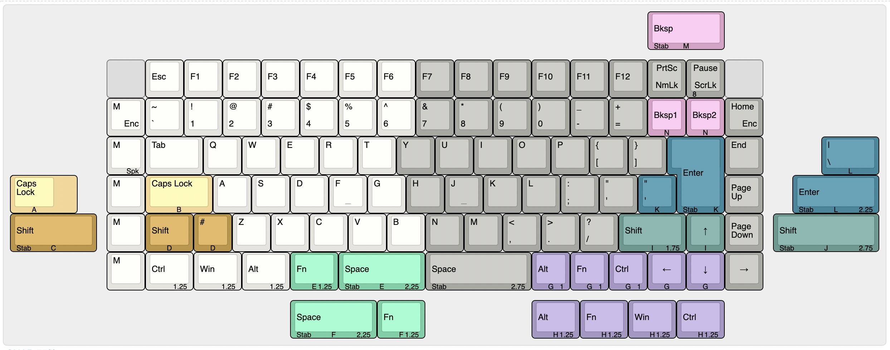

**Bloq Mayus (amarillo claro)**
| **Código** | **Disposición** |
| --- | --- |
| A | 1.75U bloq mayus alineado izq |
| B | 1.75U bloq mayus estándard|

**Shift Izquierdo (amarillo oscuro)**
| **Código** | **Disposición** |
| --- | --- |
| C | 2.25U shift izq + estabilizador |
| D | 1.25U/1U (ISO) shift izquierdo |

**Barra espaciadora (verde claro)**
| **Código** | **Disposición** |
| --- | --- |
| E | 1.25U Fn, 2.25U barra espaciadora + estabilizador |
| F | 2.25U barra espaciadora + estabilizador, 1.25U Fn |

**Modificadores derechos (morado)**
| **Código** | **Disposición** |
| --- | --- |
| G | 5x 1U modificadores + flechas |
| H | 4x 1.25U modificadores sin flechas |

**Shift derecho (verde oscuro)**
| **Código** | **Disposición** |
| --- | --- |
| I | 1.75U + 1U shift + flecha arriba |
| J | 2.75U shift + estabilizador |

**Enter (azul)**
| **Código** | **Disposición** |
| --- | --- |
| K | 1.25U + 1U ISO + estabilizador |
| L | 2.25U ANSI + estabilizador |

**Borrar (rosa)**
| **Código** | **Disposición** |
| --- | --- |
| M | 2U + estabilizador |
| N | 1U + 1U split borrar |

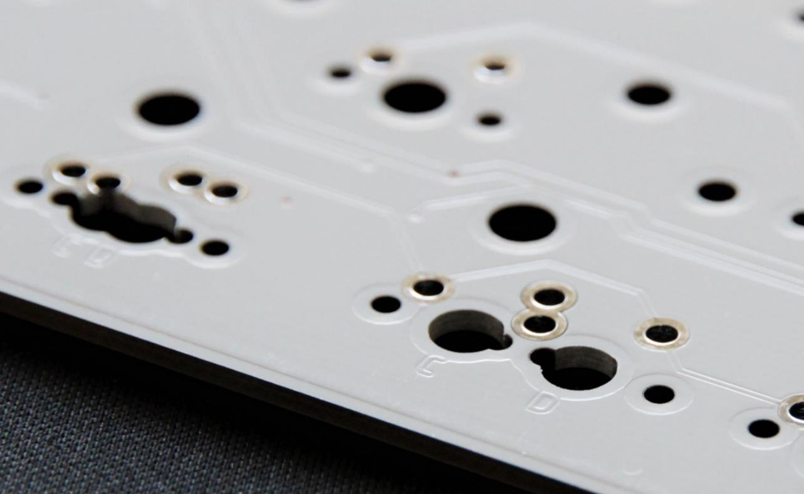

# ⚠️ **ESPERA** ⚠️

Se recomienda encarecidamente que pruebes cada tecla en este momento antes de proseguir. Si no lo has hecho aún, [Salta al paso](#firmware_flashing) 22 para flashear el firmware QMK. Usa un comprobador de teclado ([este](https://www.keyboardtester.com/) funciona) y puentea los conectores de cada interruptor usando unas pinzas, un trozo de cable, una pestaña metálica cortada de algún componente anterior o cualquier cosa eléctricamente conductiva. Si hay algún problema, será mucho más fácil solucionarlo ahora, antes de que todo haya sido soldado y montado.

## 13. Atornilla los separadores M2x3 usando tornillos M2x3

En las ubicaciones indicadas, coloca los separadores M2x3 en la parte inferior de la placa **SUPERIOR** (PCB). Atorníllalos usando 14 tornillos M2x3 (7 en cada mitad). Usa pinzas para sujetar el separador firmemente mientras atornillas. **¡No sobreaprietes el tornillo!** Este paso es especialmente importante si vas a usar placa de switches, porque es más dificil acceder a los tornillos con la placa para switches colocada, ¡así que revísalo cuidadosamente! Los separadores van en la parte inferior de la placa electrónica (PCB).

| 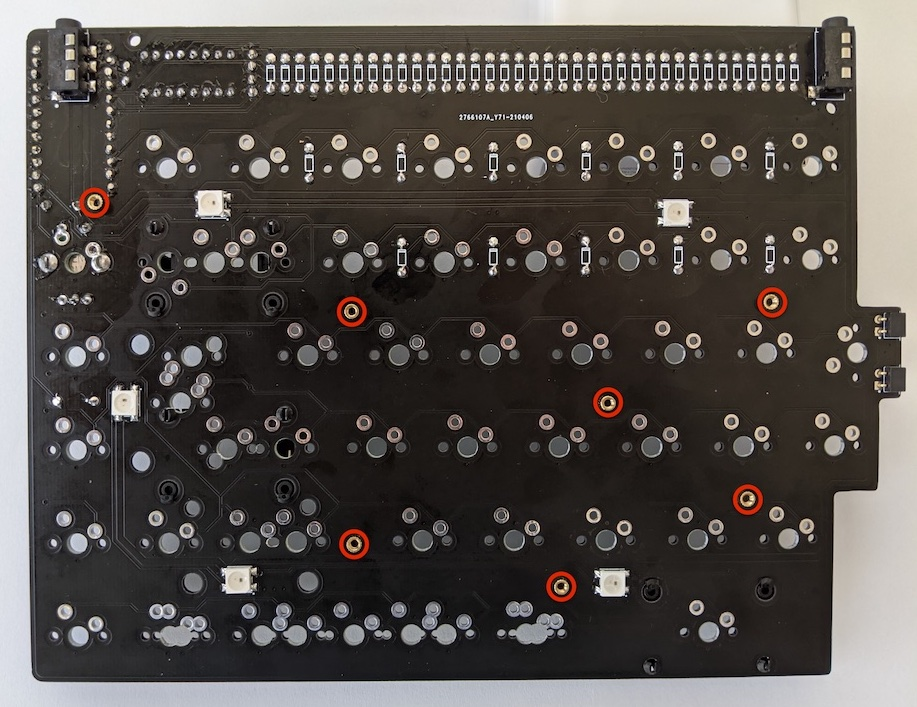 |  |
| --- | --- |

## 14. Coloca los estabilizadores

Coloca los estabilizadores (montados en PCB, con clips) tal como se indica a continuación. La pestaña va en el agujero más grande, y el clip en el pequeño. Los estabilizadores solamente encajan en una posición. Asegúrate de que el estabilizador esté firmemente encajado, o las teclas no se moverán correctamente cuando estén montadas. Si usas estabilizadores atornillados, **no** uses la arandela incluída entre el tornillo y la placa. El acrílico no asentará correctamente sobre la arandela.

## 15. [OPCIONAL] Inserta los conectores hot-swap

Si vas a usar conectores hot-swap, introduce uno en cada agujero metalizado y asegúralos con cinta (de carrocero o eléctrica sirve). Alternativamente, insértalos en cada patita de los switches montados en PCB antes de proceder.

## 16. Coloca los interruptores

⚠️ **¡Espera!** Comprueba que las keycaps encajen correctamente para asegurar que las distancias son correctas antes de soldar, especialmente la fila inferior.

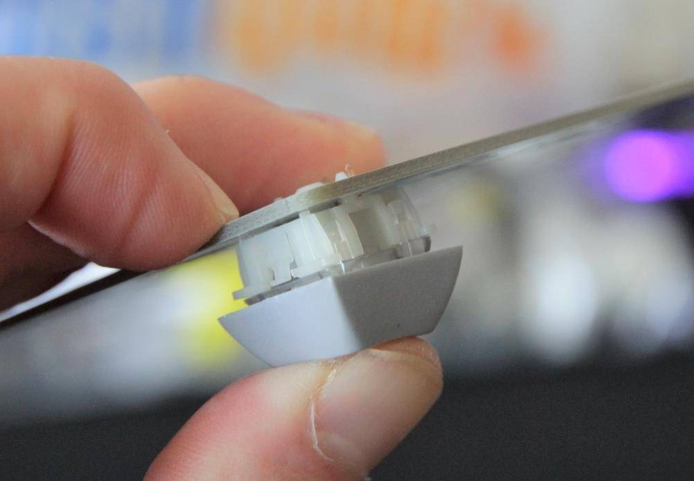

Si est;as usando interruptores de 5 pines (para montaje en PCB), probablemente requerirán bastante fuerza para ser colocados. Son así por diseño. Para los interruptores montados en PCB, un ajuste preciso los hace más estables. Encájalos sujetando la parte trasera de la PCB, y después aprieta con fuerza en la parte superior del interruptor. Ayuda usar un keycap en el switch para distribuir la presión en tu pulgar. Después de colocar los switches, confirma que estén bien asentados y alineados en el PCB.

Observa que algunos de los interruptores van montados "de lado" y algunos "del revés". ¡Es así por diseño! T, Y, \\, Enter, Borrar y Bloq Mayus son interruptores que pueden ser colocados en diferentes orientaciones.

Si estás usando sockets hotswap y una switch plate, deberás desmontar los switches de los sockets después de soldar para encajarlos en la placa en el montaje final.

## 17. Soldando switches o hot-swap sockets

⚠️ **¡Espera!** ¡Si estás usando switch plate, asegúrate de haber instalado y ajustado las piezas de montaje ( **Paso 3.13** ) y instalado los estabilizadores ( **Paso 3.14** ) antes de continuar! Una vez los switches están colocados en la placa, acceder a las cosas de edbajo es difícil.

Asegúrate de que cada conexión de los switches tenga suficiente estaño para formar una unión firme y correcta.

|  |  |
| --- | --- |

Si vas a usar hotswap sockets y switch plate, después de soldar, inserta los switches en la switch plate antes de montarlos en la PCB. Es más fácil asentar los switches de las esquinas de la placa, después alinear las placas y conectarlas, y una vez asentado ir colocando los switches restantes en la placa y sockets. La placa tiene hechos agujeros, pero no son para atornillarla al resto del teclado mediante tornillos, sino para acceder a los tornillos de debajo. Se sostiene únicamente por los propios switches.

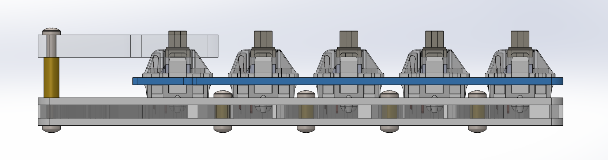

## 18a. Prepara y coloca imanes al acrílico

SNAP usa imanes fijados a las placas de acrílico para sostener las dos mitades unidas cuando se usan los pogo pin. Los imanes se mantienen unidos mediante unas peliculas adhesivas, pero también podrían ser montados usando pegamento (CA, resina epoxi o pegamento caliente) para una solución más firma y permanente. Si vas a usar pegamento para fijar los imanes, comprueba atentamente (¡y varias veces!) que los imanes de las mitades izquierda y derecha estén en la orientación correcta para que se atraigan entre ellos.

Los imanes se montan en parejas en las aperturas de las placas de acrílico tal como se indica a continuación. Observa que el papel protector debe ser despegado del acrílico antes de este paso, pero en las fotos se muestra con él aún colocado simplemente para mejorar el contraste y visibilidad en la foto.

Para montar los imanes, primero corta los adhesivos por la mitad y separa los imanes por parejas.

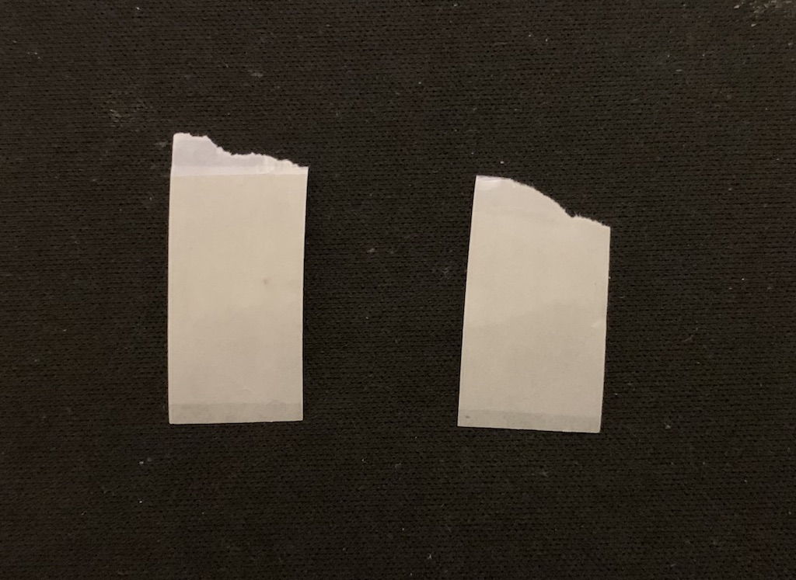

A continuación, despega una de las mitades de adhesivo y coloca el final de un imán en el centro de la parte pegajosa de la etiqueta.

Con el acrílico separado de la placa, alinea el iman con el centro del hueco, y pega la parte frontal de la pegatina al acrílico.

Adhiere firmemente ambos lados de la pegatina de manera que sostenga el imán en su sitio.

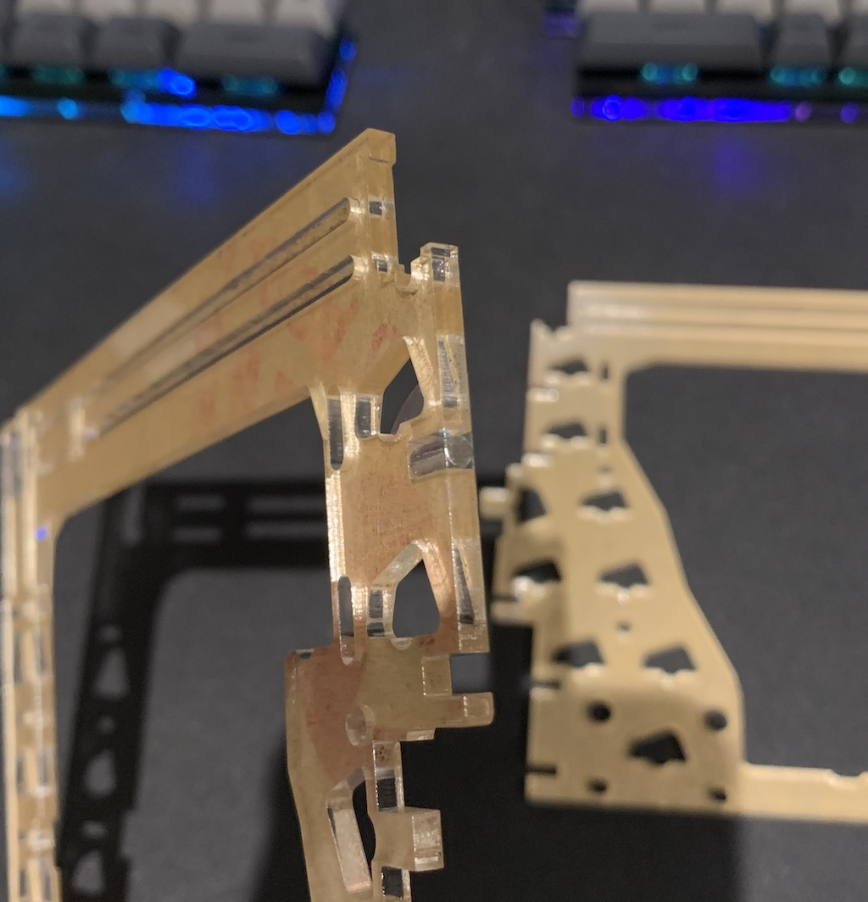

Repite estos pasos para tres de los huecos en el lado izquierdo de la placa, y despues haz lo mismo en el lado derecho de la placa. Asegúrate de comprobar que los imanes de la mitad derecha sean atraídos por los imanes del lado izquierdo antes de adherirlos con las pegatinas.

Comprueba que el acrílico encaje antes de continuar al siguiente paso para asegurar de que todas las parejas de imanes se atraen y son capaces de sujetar las dos mitades firmemente, y que ninguna pareja se repele. Si alguno de los imanes está en la posición errónea, cuidadosamente despega la pegatina del imán problema y dale la vuelta antes de proseguir. 

| 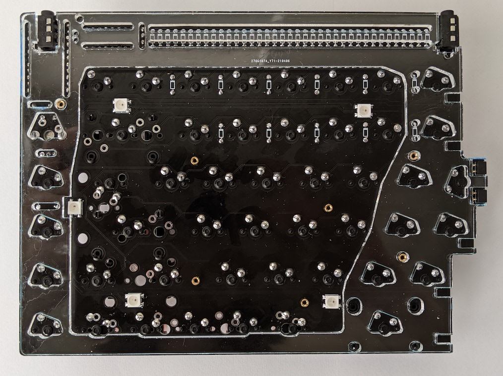 | 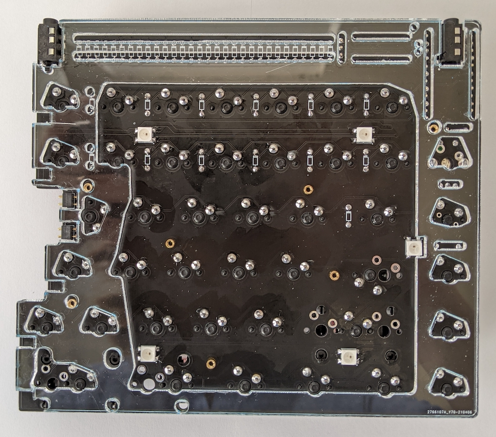 |
| --- | --- |

## 18b. Coloca la placa de acrílico sobre los separadores

Despega el papel protector del acrílico si no lo has hecho ya. Asegura que el acrílico queda recto y nivelado sobre la placa electrónica. Revisa que no haya nada que interfiera, como por ejemplo restos de conexiones insuficientemente cortadas o soldaduras demasiado grandes, altas o desviadas. Recorta con las alicates lo que sea necesario.

|  |  |
| --- | --- |

## 19. Atornilla la base con tornillos M2x3

Posiciona la placa electrónica sobre el acrílico. En los mismos lugares donde los 14 separadores, atornilla con 14 tornillos M2x3 (7 en cada mitad). **¡No los sobreaprietes!**

|  |  |
| --- | --- |

## 20. Atornilla M2x10 separadores desde la parte inferior usando tornillos M2x10

Atornilla usando 2 tornillos M2x10. Usa pinzas o alicates para sostener el separador firmemente mientras ajustes los tornillos.

|  | 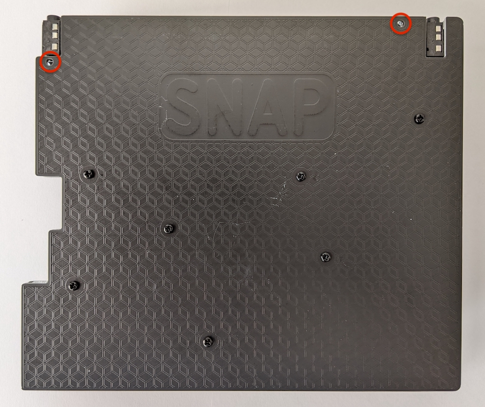 |
| --- | --- |

## 21. Monta el protector superior usando tornillos M2x6

Ajusta usando 2 tornillos M2x6. **No sobreaprietes estos**, se podría partir la tapa.

|  |  |
| --- | --- |

## 22.  Flashea firmware usando QMK toolbox

Descarga o bien un binario precompilado (únicamente si usas una Pro Micro o BIT-C) o bien el código fuente desde [GitHub](https://github.com/nullbitsco/firmware). Usando [QMK Toolbox](https://qmk.fm/toolbox/), flashea el firmware al teclado. Para más información, sigue la [Guía para flashear firmware](https://github.com/nullbitsco/docs/blob/main/firmware/firmware_flashing.md)

Aviso: ¡ambas mitades del teclado deben ser flasheadas para que funcione!

## 23. ¡Pon keycaps y disfruta!

#  4. Resolución de problemas

Diagramas útiles de referencia:  
[MCU Pinout (Izquierdo)](build_guide_img/image082.jpg)  
[MCU Pinout (Derecho)](build_guide_img/image083.jpg)  
[OLED Pinout](build_guide_img/image084.jpg)

**No funciona ninguna de las teclas**

- ¿Has flasheado firmware?
- Prueba con un cable USB distinto, otro puerto USB, y otro PC.
- Si has soldado los LEDs, comprueba que ninguno de ellos esté montado del revés. El teclado no funcionará si un LED fue montado del revés por error.
- Revisa la dirección de los diodos. La línea negra debe quedar en el extremo superior.
- Revisa la dirección de los IC. El teclado no funcionará si están en el socket del revés.
- Revisa que no hayan cortocircuitos y que el teclado se esté encendiendo correctamente Ninguna de las soldaduras debe tocar con otra.

**No funciona una única tecla**

- Revisa que el switch esté soldado correctamente en ambas conexiones.
- Bypasea el switch puenteando las dos conexiones usando unas pinzas. Si eso funciona, el problema está en el switch y debes reemplazarlo. En caso contrario, probablemente el problema sea el diodo. Puedes usar el [diagrama de diodos](https://nullbits.co/static/file/SNAP_diode_key.pdf) para ver cual diodo corresponde a cada switch.
- Revisa que todos los diodos estén soldados correctamente en ambas conexiones.
- Revisa que el mapa (disposición) de teclado (keymap en el firmware) que estés usando esté definido correctamente y case con la disposición física de tu teclado.

**No funciona una fila entera**

- A menudo esto es causado por una soldura fría en la MCU. Revisa que todas las conexiones a la MCU estén correctamente soldadas.
- Revisa que las filas y columnas estén correctamente definidas en "config.h" de QMK.

**No funciona una columna entera**

- Revisa que todas las conexiones a la MCU estén correctamente soldadas.
- Revisa que las filas y columnas estén correctamente definidas en "config.h" de QMK.
- Revisa que todas las conexiones de los IC estén correctamente soldadas..

**El rotary encoder no funciona correctamente**

- Revisa que todas las conexiones del rotary encoder estén correctamente soldadas.
- Revisa que los pines A y B estén configurados en "config.h" de QMK y así como "ENCODER\_ENABLE = yes" en "rules.mk" de QMK.

**La pantalla OLED no funciona**

- Revisa que todas las conexiones al OLED estén correctamente soldadas.
- La pantalla OLED no está activada en el firmware por defecto. Flashea el firmware 'oled', disponible en el repositorio QMK.

**Dos o má teclas están intercambiadas**

- Revisa que el keymap que estés usando esté correctamente definido y coincida con tu disposición de teclado.

**Los LEDs no están funcionando**

- Revisa que el pin RGB\_DI\_PIN esté definido en "config.h" en QMK y RGBLIGHT\_ENABLE = yes esté definido en "rules.QMK" de QMK.
- Revisa que todos los LEDs estén soldados en la orientación correcta.

**No hay energía**

- Revisa que todos los LEDs estén soldados en la orientación correcta.
- Revisa que la orientación de los IC sea la correcta.
- Revisa que no haya cortocircuitos, soldaduras con exceso de estaño, alambres demasiado largos, etc.

**¿Como hago tal cosa en el firmware?**

- Lee la documentación de QMK, o postea en [r/olkb](https://www.reddit.com/r/olkb/) buscando ayuda.
- Postea en el subreddit [r/nullbits](https://www.reddit.com/r/nullbits/), o únete al canal #firmware del [servidor de discord de nullbits](https://discord.gg/eSegJcY).

**¿Algo más?**

- Visita [nullbits.co/support/](https://nullbits.co/support/)
- Pregunta en [help@nullbits.co](mailto:help@nullbits.co)
- Únete a nuestro [Discord](https://discord.gg/eSegJcY)!
